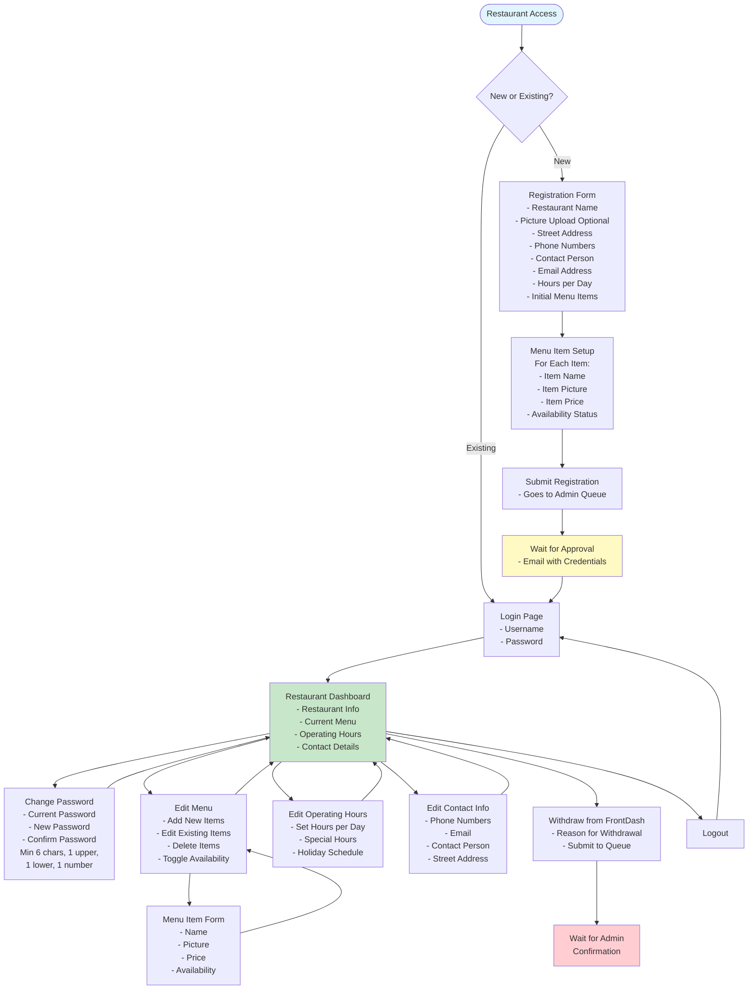
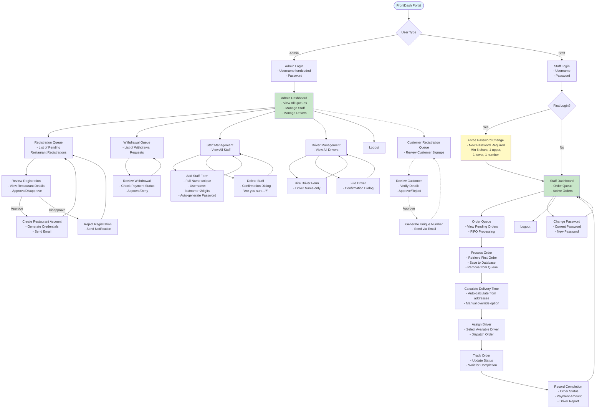

# FrontDash - Food Delivery Web Application

## 📑 Table of Contents

1. [Project Overview](#-project-overview)
2. [Tech Stack](#-tech-stack)
3. [User Interface Flow Diagrams](#-user-interface-flow-diagrams)
   - [Customer Interface Flow](#customer-interface-flow)
   - [Restaurant Interface Flow](#restaurant-interface-flow)
   - [Admin & Staff Interface Flow](#admin--staff-interface-flow)
4. [Project Structure](#-project-structure)
   - [Understanding the Next.js Structure](#understanding-the-nextjs-structure)
5. [Core Requirements Implementation Checklist](#-core-requirements-implementation-checklist)
6. [Bonus Features](#-bonus-features-25-total)
7. [Testing Requirements](#-testing-requirements)
8. [Getting Started](#-getting-started)
9. [Development Guidelines](#-development-guidelines)
10. [Team Members](#-team-members)
11. [License](#-license)
12. [Support](#-support)

## Project Overview

FrontDash is a comprehensive food delivery platform connecting restaurants with customers through an efficient delivery service. The system facilitates restaurant menu management, customer ordering, and administrative oversight of all operations.

### Key Stakeholders
- **Restaurants**: Register and manage their menus, hours, and orders
- **Customers**: Browse restaurants and order food for delivery
- **FrontDash Staff**: Process orders and coordinate deliveries
- **FrontDash Admin**: Manage platform operations and approvals
- **Drivers**: Deliver orders from restaurants to customers

### 📋 Official Clarifications Document
The professor provided clarifications on 09-08-2025 that supersede certain requirements in the original PDF:
- **Staff Account Creation**: Admin only enters first/last name; system auto-generates username and password
- **Order Completion**: Staff records delivery TIME (not amount) to track performance
- **Full clarification document**: Available at `/docs/Project Clarification-09-08-2025.pdf`

### ⚠️ Important Clarifications (Professor's Updates)
Based on recent clarifications, the following adjustments have been made to the original requirements:

1. **Staff Account Creation**: Admin only enters first and last name. System auto-generates username (lastname + 2 digits) and password.
2. **Order Completion**: Staff records delivery time (not payment amount) when driver completes delivery to track estimated vs actual delivery times.
3. **Time Tracking**: System must record order placement time and compare with actual delivery time for future optimization.

## 🚀 Tech Stack

### Frontend & Backend (Monolithic Next.js Application)
- **Next.js 14+** with App Router and TypeScript
- **Tailwind CSS** for styling
- **shadcn/ui** for UI components
- **React Hook Form** + Zod for form handling and validation
- **TanStack Query** for server state management

### Backend (API Routes within Next.js)
- **Next.js API Routes** for backend endpoints
- **Prisma ORM** for database management
- **PostgreSQL** database
- **Better-Auth** for authentication and authorization
- **Zod** for API validation
- **bcrypt** for additional password hashing

### Additional Services
- **Email Service**: Resend (for sending credentials)
- **Payment Processing**: Stripe (Test Mode)
- **Maps API**: Google Maps API (for delivery time calculations)
- **File Storage**: Uploadthing (for restaurant/menu images)
- **Queue Management**: BullMQ with Redis for production, in-memory for development

## User Interface Flow Diagrams

These diagrams show the complete screen flow for each user type in the FrontDash system. Each box represents a screen that needs to be implemented.

### Customer Interface Flow


### Restaurant Interface Flow



### Admin & Staff Interface Flow



## 📁 Project Structure

> **Note for Team**: This is our **target structure** as the project grows. We'll start simple with just the UI components for our current assignment, then gradually add the backend features (API routes, database, authentication) in future phases. Items marked with 🔮 are future implementations.

```
frontdash/
├── app/                              # Next.js App Router
│   ├── (public)/                    # Public routes (no auth)
│   │   ├── layout.tsx               # Public layout
│   │   ├── page.tsx                 # Homepage with restaurant list
│   │   ├── restaurant/
│   │   │   └── [id]/
│   │   │       ├── page.tsx         # Restaurant menu page
│   │   │       └── loading.tsx
│   │   ├── checkout/
│   │   │   ├── page.tsx             # Order confirmation
│   │   │   ├── billing/
│   │   │   │   └── page.tsx         # Billing page
│   │   │   ├── payment/
│   │   │   │   └── page.tsx         # Payment form
│   │   │   └── delivery/
│   │   │       └── page.tsx         # Delivery address form
│   │   └── order-complete/
│   │       └── page.tsx             # Order completion page
│   │
│   ├── (auth)/                      # Auth pages layout group
│   │   ├── layout.tsx               # Auth layout
│   │   ├── restaurant/
│   │   │   ├── login/
│   │   │   │   └── page.tsx
│   │   │   └── register/
│   │   │       └── page.tsx
│   │   ├── admin/
│   │   │   └── login/
│   │   │       └── page.tsx
│   │   └── staff/
│   │       └── login/
│   │           └── page.tsx
│   │
│   ├── (dashboard)/                 # Protected dashboard routes
│   │   ├── layout.tsx               # Dashboard layout with auth check
│   │   ├── restaurant/
│   │   │   ├── dashboard/
│   │   │   │   ├── page.tsx         # Restaurant main dashboard
│   │   │   │   ├── menu/
│   │   │   │   │   └── page.tsx     # Menu management
│   │   │   │   ├── hours/
│   │   │   │   │   └── page.tsx     # Hours management
│   │   │   │   ├── contact/
│   │   │   │   │   └── page.tsx     # Contact info management
│   │   │   │   ├── settings/
│   │   │   │   │   └── page.tsx     # Password, withdrawal
│   │   │   │   └── loading.tsx
│   │   │   └── middleware.ts        # 🔮 Restaurant auth middleware
│   │   │
│   │   ├── admin/
│   │   │   ├── dashboard/
│   │   │   │   ├── page.tsx         # Admin main dashboard
│   │   │   │   ├── registrations/
│   │   │   │   │   └── page.tsx     # Registration queue
│   │   │   │   ├── withdrawals/
│   │   │   │   │   └── page.tsx     # Withdrawal queue
│   │   │   │   ├── staff/
│   │   │   │   │   └── page.tsx     # Staff management
│   │   │   │   ├── drivers/
│   │   │   │   │   └── page.tsx     # Driver management
│   │   │   │   └── customers/       # Bonus feature
│   │   │   │       └── page.tsx     # Customer registrations
│   │   │   └── middleware.ts        # 🔮 Admin auth middleware
│   │   │
│   │   └── staff/
│   │       ├── dashboard/
│   │       │   ├── page.tsx         # Staff main dashboard
│   │       │   ├── orders/
│   │       │   │   └── page.tsx     # Order queue management
│   │       │   ├── active/
│   │       │   │   └── page.tsx     # Active orders tracking
│   │       │   └── settings/
│   │       │       └── page.tsx     # Password change
│   │       └── middleware.ts        # 🔮 Staff auth middleware
│   │
│   ├── api/                         # 🔮 API Routes (Backend - Future)
│   │   ├── auth/
│   │   │   ├── login/
│   │   │   │   └── route.ts
│   │   │   └── logout/
│   │   │       └── route.ts
│   │   ├── restaurants/
│   │   │   └── route.ts
│   │   ├── orders/
│   │   │   └── route.ts
│   │   └── ...                      # More API routes as needed
│   │
│   ├── layout.tsx                   # Root layout
│   ├── globals.css                  # Global styles
│   └── providers.tsx                # Client providers wrapper
│
├── components/                      # Reusable components
│   ├── ui/                          # shadcn/ui components
│   │   ├── button.tsx
│   │   ├── card.tsx
│   │   ├── dialog.tsx
│   │   ├── form.tsx
│   │   └── ...
│   ├── forms/
│   │   ├── RestaurantRegistrationForm.tsx
│   │   ├── MenuItemForm.tsx
│   │   ├── PaymentForm.tsx
│   │   ├── DeliveryAddressForm.tsx
│   │   └── ...
│   ├── layouts/
│   │   ├── CustomerHeader.tsx
│   │   ├── RestaurantSidebar.tsx
│   │   ├── AdminSidebar.tsx
│   │   └── StaffSidebar.tsx
│   └── shared/
│       ├── LoadingSpinner.tsx
│       ├── ErrorBoundary.tsx
│       └── ConfirmDialog.tsx
│
├── lib/                             # Library code
│   ├── auth/                        # Future: Authentication
│   ├── db/                          # Future: Database connections
│   ├── email/                       # Future: Email service
│   ├── payment/                     # Future: Payment processing
│   ├── queue/                       # Future: Queue management
│   ├── validations/
│   │   ├── restaurant.ts           # Zod schemas for validation
│   │   ├── order.ts
│   │   ├── user.ts
│   │   └── payment.ts
│   └── utils/
│       ├── format.ts               # Formatting utilities
│       └── constants.ts            # App constants
│
├── prisma/                         # Future: Database
│   ├── schema.prisma
│   └── migrations/
│
├── public/                         # Static files
│   ├── images/
│   └── uploads/                    # Future: Uploaded images
│
├── hooks/                          # Custom React hooks
│   ├── useCart.ts                  # Shopping cart logic
│   ├── useRestaurant.ts
│   └── useOrder.ts
│
├── types/                          # TypeScript types
│   ├── restaurant.ts
│   ├── order.ts
│   ├── user.ts
│   └── api.ts
│
├── middleware.ts                   # Future: Next.js middleware
├── next.config.js                  # Next.js configuration
├── package.json
├── tsconfig.json
├── tailwind.config.ts
├── .env.local                      # Future: Environment variables
├── .env.example
└── README.md
```

### Understanding the Next.js Structure

**For teammates new to Next.js, here's what you need to know:**

#### 🎯 Current Focus (UI Assignment)
For our current UI assignment, we'll primarily work in:
- `app/` folder - where all our pages live
- `components/` folder - reusable UI components
- `public/` folder - static images and assets

#### 📂 How Next.js Works

**1. File-Based Routing**
- Unlike traditional React where you configure routes manually, Next.js creates routes based on your file structure
- `app/page.tsx` → becomes the homepage (`/`)
- `app/restaurant/[id]/page.tsx` → becomes `/restaurant/123` (where 123 is any ID)
- `app/(auth)/restaurant/login/page.tsx` → becomes `/restaurant/login`

**2. Route Groups with Parentheses ()**
- Folders wrapped in parentheses like `(public)` don't appear in the URL
- They're for organizing code and sharing layouts
- Example: `app/(public)/restaurant/` → URL is just `/restaurant/`

**3. Layout Files**
- `layout.tsx` files wrap all pages in that folder
- Great for shared navigation, headers, sidebars
- Example: All customer pages share the same header through `(public)/layout.tsx`

**4. Dynamic Routes with Brackets []**
- `[id]` folders create dynamic routes
- `restaurant/[id]/page.tsx` handles any restaurant ID
- The ID becomes available as a parameter in your component

**5. API Routes (Future Backend)**
- Files in `app/api/` become backend endpoints
- `app/api/restaurants/route.ts` → handles requests to `/api/restaurants`
- This is where we'll add database operations later

#### 🏗️ Building Process

**Phase 1 (Current)**: Build all UI components and pages
- Create all the screens shown in the flow diagrams
- Use mock data for now (hardcoded arrays of restaurants, menu items, etc.)
- Focus on form validation and user experience

**Phase 2 (Next)**: Add Backend Features
- Implement API routes in `app/api/`
- Connect to PostgreSQL database
- Add authentication for different user types
- Implement queue management systems

**Phase 3 (Final)**: Integration
- Connect UI to real API endpoints
- Add payment processing
- Implement email notifications
- Deploy to production

#### 💡 Key Benefits of This Structure

1. **Single Codebase**: Frontend and backend in one project
2. **Type Safety**: TypeScript everywhere means fewer bugs
3. **Fast Development**: File-based routing = less configuration
4. **Easy Deployment**: One app to deploy, not separate frontend/backend
5. **Built-in Optimizations**: Next.js handles performance automatically

## 🔄 Component Independence Architecture

While built as a monolithic Next.js application, the three components operate independently through:

### Route Isolation
- **Customer Interface**: `/` and `/restaurant/*` - No authentication required
- **Restaurant Portal**: `/restaurant/dashboard/*` - Restaurant auth only
- **Admin/Staff Portal**: `/admin/*` and `/staff/*` - Role-based auth

### State Separation
- Each component maintains its own state management
- No shared client-side state between components
- Communication only through database and API

### Concurrent Operation
- Multiple users can operate different components simultaneously
- Restaurant changes reflect immediately for customers
- Staff can process orders while customers place new ones
- Admin operations don't block other components

This architecture satisfies the requirement that "all three components can be developed independently and should be possible to use them concurrently."

## 🗺️ Route Structure

> **Route Status**: ✅ = Implemented | 🔄 = Not Implemented Yet | ⭐ = Bonus Feature

### Public Routes (No Authentication Required)

#### Customer Flow
```typescript
'/'                                     // ✅ Homepage - Browse all restaurants
'/restaurant/[id]'                      // 🔄 View specific restaurant menu
'/checkout'                             // 🔄 Order review/confirmation
'/checkout/payment'                     // 🔄 Payment form
'/checkout/delivery'                    // 🔄 Delivery address form
'/order/[orderId]/confirmation'         // 🔄 Order complete with tracking number
```

#### Registration Pages (Public)
```typescript
'/restaurant/register'                  // 🔄 Restaurant registration form
'/customer/register'                    // 🔄 ⭐ Customer loyalty registration (bonus)
```

### Authentication Routes

#### Unified Authentication
```typescript
'/login'                               // ✅ Unified login for admin/staff (username/password)
'/logout'                              // 🔄 Logout endpoint for all user types

// After login, redirects to:
// Admin → '/admin/dashboard' ✅
// Staff → '/staff/dashboard' 🔄
```

### Protected Routes (Authentication Required)

#### Restaurant Dashboard
```typescript
'/restaurant/dashboard'                 // 🔄 Main restaurant dashboard
'/restaurant/dashboard/menu'            // 🔄 Menu management
'/restaurant/dashboard/menu/[itemId]/edit' // 🔄 Edit specific menu item
'/restaurant/dashboard/menu/new'        // 🔄 Add new menu item
'/restaurant/dashboard/hours'           // 🔄 Operating hours management
'/restaurant/dashboard/contact'         // 🔄 Contact info management
'/restaurant/dashboard/settings'        // 🔄 Password change, withdrawal
'/restaurant/dashboard/orders'          // 🔄 View orders (future feature)
```

#### Admin Portal
```typescript
'/admin/dashboard'                      // ✅ Admin main dashboard with complete tables
'/admin/restaurants'                    // 🔄 Restaurant management overview
'/admin/restaurants/registrations'      // 🔄 Registration queue management
'/admin/restaurants/withdrawals'        // 🔄 Withdrawal queue management
'/admin/restaurants/[id]'               // 🔄 View specific restaurant details
'/admin/staff'                          // 🔄 Staff management
'/admin/staff/new'                      // 🔄 Add new staff form
'/admin/staff/[id]'                     // 🔄 View/edit specific staff
'/admin/drivers'                        // 🔄 Driver management
'/admin/drivers/new'                    // 🔄 Hire new driver form
'/admin/customers'                      // 🔄 ⭐ Customer registrations (bonus)
'/admin/orders'                         // 🔄 All orders overview
'/admin/reports'                        // 🔄 Analytics/reports (future)
```

#### Staff Portal
```typescript
'/staff/dashboard'                      // 🔄 Staff main dashboard
'/staff/orders'                         // 🔄 Order queue management
'/staff/orders/[orderId]'               // 🔄 Process specific order
'/staff/orders/[orderId]/assign'        // 🔄 Assign driver to order
'/staff/orders/[orderId]/complete'      // 🔄 Mark order complete
'/staff/active'                         // 🔄 Active orders tracking
'/staff/settings'                       // 🔄 Password change
'/staff/first-login'                    // 🔄 Force password change on first login
```

### Driver Portal (Minimal Interface)
```typescript
'/driver/[driverId]/active'             // 🔄 Current delivery
'/driver/[driverId]/history'            // 🔄 Delivery history
```

### API Routes (Backend - BetterAuth + Custom)

#### Authentication (BetterAuth)
```typescript
'/api/auth/**'                          // 🔄 BetterAuth endpoints
'/api/auth/sign-in'                     // 🔄 Login endpoint
'/api/auth/sign-out'                    // 🔄 Logout endpoint
'/api/auth/session'                     // 🔄 Session management
```

#### Business Logic APIs
```typescript
'/api/restaurants'                      // 🔄 Restaurant CRUD operations
'/api/restaurants/[id]'                 // 🔄 Specific restaurant operations
'/api/restaurants/[id]/menu'            // 🔄 Menu management
'/api/restaurants/register'             // 🔄 Restaurant registration
'/api/restaurants/withdraw'             // 🔄 Restaurant withdrawal

'/api/orders'                           // 🔄 Order management
'/api/orders/queue'                     // 🔄 Order queue operations
'/api/orders/[id]/complete'             // 🔄 Mark order complete
'/api/orders/[id]/assign-driver'        // 🔄 Assign driver to order

'/api/payment/process'                  // 🔄 Payment processing
'/api/payment/verify'                   // 🔄 Payment verification (third-party)

'/api/delivery/calculate'               // 🔄 Delivery time calculation
'/api/delivery/estimate'                // 🔄 Address-based delivery estimates

'/api/admin/queues/registrations'       // 🔄 Registration queue management
'/api/admin/queues/withdrawals'         // 🔄 Withdrawal queue management
'/api/admin/staff'                      // 🔄 Staff account management
'/api/admin/drivers'                    // 🔄 Driver management
'/api/admin/customers'                  // 🔄 ⭐ Customer registrations (bonus)

'/api/email/send-credentials'           // 🔄 Send login credentials
'/api/email/send-confirmation'          // 🔄 Send order confirmation

'/api/loyalty/points'                   // 🔄 ⭐ Loyalty points management
'/api/loyalty/redeem'                   // 🔄 ⭐ Redeem points for discount
```

### Utility Routes
```typescript
'/404'                                  // Custom not found page
'/500'                                  // Custom server error page
'/maintenance'                          // 🔄 Maintenance mode page
'/health'                               // 🔄 Health check endpoint
```

### Route Access Control

#### Public Access
- Homepage and restaurant browsing
- Customer ordering flow (no login required)
- Public registration forms

#### Role-Based Access
- **Admin**: Full access to admin portal + staff/driver management
- **Staff**: Order processing + password management
- **Restaurant**: Own dashboard + menu/hours management only

#### Authentication Flow
1. All admin/staff users → `/login`
2. System determines user type after authentication
3. Redirect to appropriate dashboard:
   - Admin → `/admin/dashboard`
   - Staff → `/staff/dashboard`
4. Role middleware protects route access

## 🎯 Core Requirements Implementation Checklist

### 1. Restaurant Module

#### Registration System
- [ ] Restaurant name field with unique validation
- [ ] Restaurant image upload (optional)
- [ ] Street address field (required for driver pickup)
- [ ] Phone number field with validation (10 digits, first digit not 0)
- [ ] Add multiple phone numbers functionality
- [ ] Contact person field
- [ ] Email address field (required)
- [ ] Hours of operation for each day of week
- [ ] Menu creation with multiple items
  - [ ] Item name
  - [ ] Item image upload
  - [ ] Item price
  - [ ] Availability status (AVAILABLE/UNAVAILABLE)
- [ ] Submit registration to queue (not immediate approval)
- [ ] Admin approval workflow
- [ ] Email credentials upon approval

#### Restaurant Portal
- [ ] Login page with username/password
- [ ] Logout functionality
- [ ] Change password feature
  - [ ] Minimum 6 characters validation
  - [ ] At least 1 uppercase letter
  - [ ] At least 1 lowercase letter
  - [ ] At least 1 number
- [ ] Dashboard with restaurant info display
- [ ] Edit menu functionality
  - [ ] Add new items
  - [ ] Edit existing items
  - [ ] Delete items
  - [ ] Update availability status
- [ ] Edit operating hours
  - [ ] Set hours for each day
  - [ ] Handle special hours/holidays
- [ ] Edit contact information
  - [ ] Update phone numbers
  - [ ] Update email
  - [ ] Update contact person
  - [ ] Update address
- [ ] Withdraw from FrontDash
  - [ ] Withdrawal reason form
  - [ ] Submit to admin queue
  - [ ] Await confirmation

### 2. Customer Module (No Login Required)

#### Browse & Select
- [x] Homepage with restaurant grid
- [ ] Restaurant cards showing:
  - [x] Restaurant name
  - [ ] Restaurant logo/image
  - [x] Open/Closed status based on current time
- [x] Restaurant selection functionality
- [x] Menu browsing page showing:
  - [x] All menu items
  - [x] Item images
  - [x] Item prices
  - [x] Availability status
  - [x] Quantity selector for each item
  - [x] Add to cart functionality

#### Order & Billing
- [x] Order confirmation page displaying:
  - [x] Restaurant name
  - [x] Current date and time
  - [x] Ordered items with:
    - [x] Item name
    - [x] Price per item
    - [x] Quantity
    - [x] Subtotal per item
  - [x] Total before service charge
  - [x] Service charge (8.25%)
  - [x] Tips input field
    - [x] Percentage-based option
    - [x] Fixed amount option
  - [x] Grand total calculation

#### Payment Processing
- [x] Credit card payment form:
  - [x] Card type selection (VISA, MasterCard, Discover, etc.)
  - [x] Card number field (16 digits validation)
  - [x] Cardholder first name (min 2 letters)
  - [x] Cardholder last name (min 2 letters)
  - [x] Billing address
  - [x] Expiry date (month/year)
  - [x] Security code (3 digits)
- [x] Third-party payment verification (mocked)
- [ ] Payment confirmation

#### Delivery Information
- [ ] Delivery address form:
  - [ ] Building number
  - [ ] Street name
  - [ ] Apartment/unit number (optional)
  - [ ] City
  - [ ] State
  - [ ] Contact person name
  - [ ] Contact phone (10 digits validation)
- [ ] Generate order number
- [ ] Calculate and display estimated delivery time
- [ ] Order confirmation page

### 3. Administrator Module

#### Admin Authentication
- [ ] Hard-coded admin account (backend database seeding required)
- [x] Admin login page
- [ ] Admin logout functionality
- [x] Admin dashboard

#### Restaurant Management
- [ ] View registration request queue
- [ ] Approve restaurant registration
  - [ ] Create restaurant account
  - [ ] Generate credentials
  - [ ] Send email with credentials
- [ ] Disapprove restaurant registration
- [ ] View withdrawal request queue
- [ ] Approve withdrawal request
- [ ] Deny withdrawal request (e.g., payment due)

#### Staff Management
- [ ] Add staff account form:
  - [ ] Full name (must be unique)
  - [ ] Generate username (lastname + 2 digits)
  - [ ] Auto-generate initial password
- [ ] View all staff accounts
- [ ] Delete staff account
  - [ ] Confirmation dialog
  - [ ] Remove from database

#### Driver Management
- [ ] Hire driver form (name only)
- [ ] View all drivers
- [ ] Fire driver
  - [ ] Confirmation dialog
  - [ ] Remove from database

### 4. Staff Module

#### Staff Authentication
- [ ] Staff login page
- [ ] Staff logout functionality
- [ ] Force password change on first login
- [ ] Password change interface

#### Order Management
- [ ] View order queue
- [ ] Retrieve first order from queue
- [ ] Save order to database before removing from queue
- [ ] Calculate delivery time
  - [ ] Automatic calculation based on addresses
  - [ ] Manual override option
- [ ] Assign driver to order
- [ ] Record order completion
  - [ ] Update order status
  - [ ] Record payment amount

### 5. General System Requirements

#### Security & Validation
- [ ] Password encryption in database (backend required)
- [x] Password never displayed in UI
- [x] Password masking in all input fields
- [ ] Username format validation (2 chars + 2 digits, except admin)
- [ ] Phone number validation (10 digits, first not 0)
- [ ] Credit card validation (16 digits, first not 0)
- [ ] Name validation (minimum 2 letters)
- [ ] Email format validation

#### User Interface
- [ ] Success messages for all actions
- [ ] Error messages for validation failures
- [ ] Confirmation dialogs for all deletions
  - [ ] "Are you sure you want to delete [item]?"
  - [ ] Require explicit confirmation
- [ ] Loading states for async operations
- [ ] Responsive design for all screen sizes

#### System Architecture
- [ ] Restaurant component works independently
- [ ] Customer interface works independently
- [ ] Admin/Staff component works independently
- [ ] All components can run concurrently
- [ ] RESTful API design
- [ ] Proper error handling
- [ ] Database transaction management

### 6. Database Schema

#### Required Tables
- [ ] restaurants
- [ ] menu_items
- [ ] orders
- [ ] order_items
- [ ] administrators
- [ ] staff_accounts
- [ ] drivers
- [ ] registration_queue
- [ ] withdrawal_queue
- [ ] order_queue
- [ ] customers (bonus feature)
- [ ] customer_points (bonus feature)

### 7. Queue Management

#### Implementation Requirements
- [ ] Restaurant registration queue
- [ ] Restaurant withdrawal queue
- [ ] Customer order queue
- [ ] FIFO processing for all queues
- [ ] Queue persistence in database
- [ ] Queue status tracking

## 🌟 Bonus Features (25% Total)

### Customer Loyalty System (20%)
- [ ] Customer registration form:
  - [ ] Full name
  - [ ] Phone number
  - [ ] Email
  - [ ] Default delivery address
  - [ ] Credit card details
- [ ] Registration approval queue
- [ ] Generate unique customer number
- [ ] Email customer number upon approval
- [ ] Points tracking system:
  - [ ] 1 point per dollar (before service/tips)
  - [ ] Display current points balance
  - [ ] 10% discount at 100+ points
  - [ ] Deduct 100 points when discount used
- [ ] Customer number input during ordering
- [ ] Apply discount automatically when eligible

### Spring Security Implementation (5%)
- [ ] Implement Spring Security framework
- [ ] Role-based access control (RBAC)
- [ ] JWT token authentication
- [ ] Session management
- [ ] CSRF protection
- [ ] Password encryption with BCrypt
- [ ] Create implementation report with:
  - [ ] Security features overview
  - [ ] Sample code snippets
  - [ ] Configuration examples

## 🧪 Testing Requirements

### Unit Tests
- [ ] Model/Entity tests
- [ ] Service layer tests
- [ ] Controller tests
- [ ] Validation tests

### Integration Tests
- [ ] API endpoint tests
- [ ] Database operation tests
- [ ] Authentication flow tests
- [ ] Payment processing tests

### End-to-End Tests
- [ ] Complete restaurant registration flow
- [ ] Complete customer ordering flow
- [ ] Admin approval workflows
- [ ] Staff order processing flow

### Performance Tests
- [ ] Concurrent user testing
- [ ] Database query optimization
- [ ] API response time benchmarks

## 🚦 Getting Started

### Prerequisites
- Node.js 18+ and npm/yarn
- PostgreSQL (for future backend)
- Git

### Installation

1. Clone the repository
```bash
git clone https://github.com/kassi-bertrand/frontdash.git
cd frontdash
```

2. Install dependencies
```bash
npm install
# or
yarn install
```

3. Set up environment variables (for future backend)
```bash
cp .env.example .env.local
```

4. Run the development server
```bash
npm run dev
# or
yarn dev
```

5. Open [http://localhost:3000](http://localhost:3000) in your browser

## 📝 Development Guidelines

### How to Contribute to the Repository

**⚠️ Important: The `main` branch is protected. All changes must be made through pull requests.**

#### Quick Start (5 Steps)

1. **Get Latest Code**
   ```bash
   git checkout main
   git pull origin main
   ```

2. **Create Your Feature Branch**
   ```bash
   git checkout -b feature/your-feature-name
   ```
   Examples: `feature/add-login-page`, `fix/restaurant-menu-bug`, `docs/update-readme`

3. **Make Changes & Commit**
   ```bash
   git add .
   git commit -m "feat(auth): add user login functionality"
   ```
   Use format: `type(scope): description` ([Learn more about commit conventions](https://www.conventionalcommits.org/))

4. **Push & Create Pull Request**
   ```bash
   git push origin feature/your-feature-name
   ```
   Then go to GitHub → "Pull Requests" → "New Pull Request"

5. **Tag @kassi-bertrand as Reviewer**
   Add a clear title and description of your changes.

#### Branch Naming Convention
- `feature/` - New features (e.g., `feature/restaurant-registration`)
- `fix/` - Bug fixes (e.g., `fix/payment-validation`)
- `docs/` - Documentation updates (e.g., `docs/api-guide`)
- `refactor/` - Code improvements (e.g., `refactor/auth-components`)

#### After Your PR is Merged
```bash
git checkout main
git pull origin main
git branch -d feature/your-feature-name  # Clean up local branch
```

**📖 Need Help?** Check out this [comprehensive Git workflow guide](https://docs.github.com/en/get-started/quickstart/github-flow) or ask the team!

### Code Standards
- TypeScript strict mode enabled
- ESLint and Prettier configured

## 👥 Team Members

- Marione Ogboi
- Daniel Oni
- Kassi Nzalasse

## 📄 License

This project is developed for CS 5336/7336 - Web Application Development course.

## 📞 Support

For questions or issues, please contact the team or open an issue in the repository.
