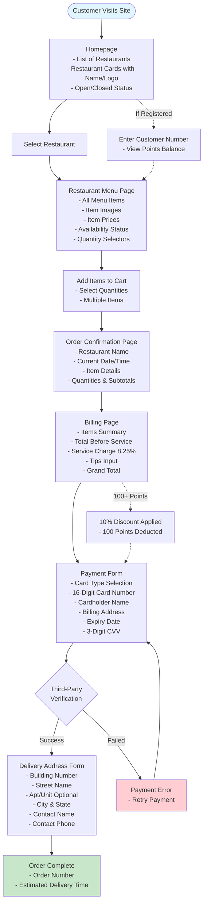
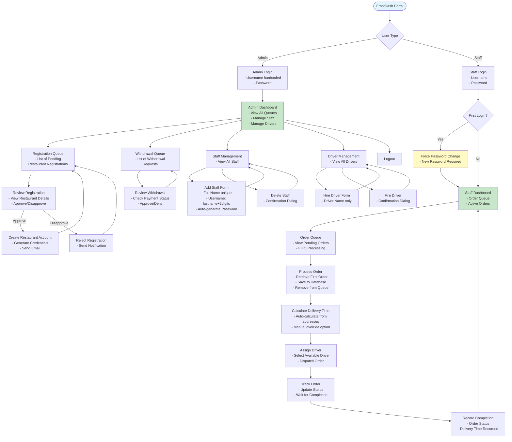

# FrontDash - Food Delivery Web Application

## 📑 Table of Contents

1. [Project Overview](#-project-overview)
2. [Tech Stack](#-tech-stack)
3. [User Interface Flow Diagrams](#-user-interface-flow-diagrams)
   - [Customer Interface Flow](#customer-interface-flow)
   - [Restaurant Interface Flow](#restaurant-interface-flow)
   - [Admin & Staff Interface Flow](#admin--staff-interface-flow)
4. [Project Structure](#-project-structure)
   - [Understanding the Next.js Structure](#understanding-the-nextjs-structure)
5. [Core Requirements Implementation Checklist](#-core-requirements-implementation-checklist)
6. [Bonus Features](#-bonus-features-25-total)
7. [Testing Requirements](#-testing-requirements)
8. [Getting Started](#-getting-started)
9. [Development Guidelines](#-development-guidelines)
10. [Endpoints](#endpoints)
11. [Admin Login (Local)](#admin-login-local)
12. [Authentication Model Note](#authentication-model-note)
13. [Team Members](#-team-members)
14. [License](#-license)
15. [Support](#-support)

## Project Overview

FrontDash is a comprehensive food delivery platform connecting restaurants with customers through an efficient delivery service. The system facilitates restaurant menu management, customer ordering, and administrative oversight of all operations.

Design clarifications reflected in the app and docs:
- Address modeled as a first-class value object:
  - Restaurant has a business Address
  - Order stores a delivery Address snapshot
- Endpoints summarized below for quick reference
- Authentication model clarified:
  - AccountLogin is the centralized credential store
  - Restaurant and StaffMember do NOT have structural (DB-enforced) foreign keys to AccountLogin in the domain model; authentication is handled by AuthService/AuthController

### Key Stakeholders
- **Restaurants**: Register and manage their menus, hours, and orders
- **Customers**: Browse restaurants and order food for delivery
- **FrontDash Staff**: Process orders and coordinate deliveries
- **FrontDash Admin**: Manage platform operations and approvals
- **Drivers**: Deliver orders from restaurants to customers

### 📋 Official Clarifications Document
The professor provided clarifications on 09-08-2025 that supersede certain requirements in the original PDF:
- **Staff Account Creation**: Admin only enters first/last name; system auto-generates username and password
- **Order Completion**: Staff records delivery TIME (not amount) to track performance
- **Full clarification document**: Available at `/docs/Project Clarification-09-08-2025.pdf`

### ⚠️ Important Clarifications (Professor's Updates)
Based on recent clarifications, the following adjustments have been made to the original requirements:

1. **Staff Account Creation**: Admin only enters first and last name. System auto-generates username (lastname + 2 digits) and password.
2. **Order Completion**: Staff records delivery time (not payment amount) when driver completes delivery to track estimated vs actual delivery times.
3. **Time Tracking**: System must record order placement time and compare with actual delivery time for future optimization.

## 🚀 Tech Stack

### Frontend & Backend (Monolithic Next.js Application)
- **Next.js 14+** with App Router and TypeScript
- **Tailwind CSS** for styling
- **shadcn/ui** for UI components
- **React Hook Form** + Zod for form handling and validation
- **TanStack Query** for server state management

### Backend (API Routes within Next.js)
- **Next.js API Routes** for backend endpoints
- **Prisma ORM** for database management
- **PostgreSQL** database
- **Better-Auth** for authentication and authorization
- **Zod** for API validation
- **bcrypt** for additional password hashing

### Additional Services
- **Email Service**: Resend (for sending credentials)
- **Payment Processing**: Stripe (Test Mode)
- **Maps API**: Google Maps API (for delivery time calculations)
- **File Storage**: Uploadthing (for restaurant/menu images)
- **Queue Management**: BullMQ with Redis for production, in-memory for development

## User Interface Flow Diagrams

These diagrams show the complete screen flow for each user type in the FrontDash system. Each box represents a screen that needs to be implemented.

### Customer Interface Flow



### Restaurant Interface Flow


### Admin & Staff Interface Flow



## 📁 Project Structure

> **Note for Team**: This is our **target structure** as the project grows. We'll start simple with just the UI components for our current assignment, then gradually add the backend features (API routes, database, authentication) in future phases. Items marked with 🔮 are future implementations.

```
frontdash/
├── app/                              # Next.js App Router
│   ├── (public)/                    # Public routes (no auth)
│   ├── (auth)/                      # Auth pages layout group
│   ├── (dashboard)/                 # Protected dashboard routes
│   ├── api/                         # 🔮 API Routes (Backend - Future)
│   ├── layout.tsx                   # Root layout
│   ├── globals.css                  # Global styles
│   └── providers.tsx                # Client providers wrapper
├── components/                      # Reusable components
├── lib/                             # Library code (future: auth/db/email/payment/queue)
├── prisma/                          # Future: Database
├── public/                          # Static files
├── hooks/                           # Custom React hooks
├── types/                           # TypeScript types
├── middleware.ts                    # Future: Next.js middleware
├── next.config.ts                   # Next.js configuration
├── package.json
├── tsconfig.json
├── tailwind.config.ts
├── .env.example
└── README.md
```

### Understanding the Next.js Structure
(unchanged — see above for App Router notes)

## 🎯 Core Requirements Implementation Checklist
(unchanged — see existing checklist)

## 🌟 Bonus Features (25% Total)
(unchanged — see existing bonus section)

## 🧪 Testing Requirements
(unchanged — see existing testing section)

## 🚦 Getting Started

### Prerequisites
- Node.js 18+ and npm/yarn
- PostgreSQL (for future backend)
- Git

### Installation

1. Clone the repository
```bash
git clone https://github.com/kassi-bertrand/frontdash.git
cd frontdash
```

2. Install dependencies
```bash
npm install
# or
yarn install
```

3. Set up environment variables (for future backend)
```bash
# macOS/Linux
cp .env.example .env.local
# Windows PowerShell
Copy-Item .env.example .env.local
```

4. Run the development server
```bash
npm run dev
# or
yarn dev
```

5. Open [http://localhost:3000](http://localhost:3000) in your browser

## Endpoints

- Auth
  - POST /api/auth/login — login
  - POST /api/auth/change-password — changePassword
  - POST /api/auth/logout — logout
- Restaurants
  - GET /api/restaurants — list
  - GET /api/restaurants/:id — get
  - POST /api/restaurants/register — register
  - PUT /api/restaurants/:id/approve — approve
- Menu
  - GET /api/restaurants/:id/menu — getMenu
  - POST /api/restaurants/:id/menu — addItem
- Orders
  - POST /api/orders — createOrder
  - GET /api/orders/:orderNumber — getOrder
  - PUT /api/orders/:orderNumber/status — updateStatus
- Loyalty
  - POST /api/loyalty-members/register — registerMember
  - GET /api/loyalty-members/:loyaltyNumber — getMember
- Health
  - GET /health — health

Note: Additional planned API routes are listed in the “Route Structure” section above.

## Admin Login (Local)
- Admin login page: http://localhost:3000/admin/login
- Unified login (admin/staff): http://localhost:3000/login (if enabled)

If authentication isn't wired yet, the login page still renders; backend setup is required for real auth.

## Authentication Model Note
- AccountLogin is the canonical credential store (username, passwordHash, role, accountState)
- Restaurant and StaffMember do NOT have structural FK links to AccountLogin in the domain model
- AuthService/AuthController handle authentication and lookups
- Restaurant/Staff may store username as a string reference, but it is not enforced as a cascade FK

## 👥 Team Members

- Marione Ogboi
- Daniel Oni
- Kassi Nzalasse

## 📄 License

This project is developed for CS 5336/7336 - Web Application Development course.

## 📞 Support

For questions or issues, please contact the team or open an issue in the repository.