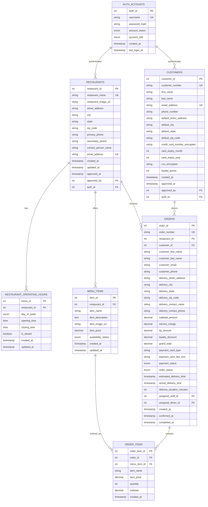
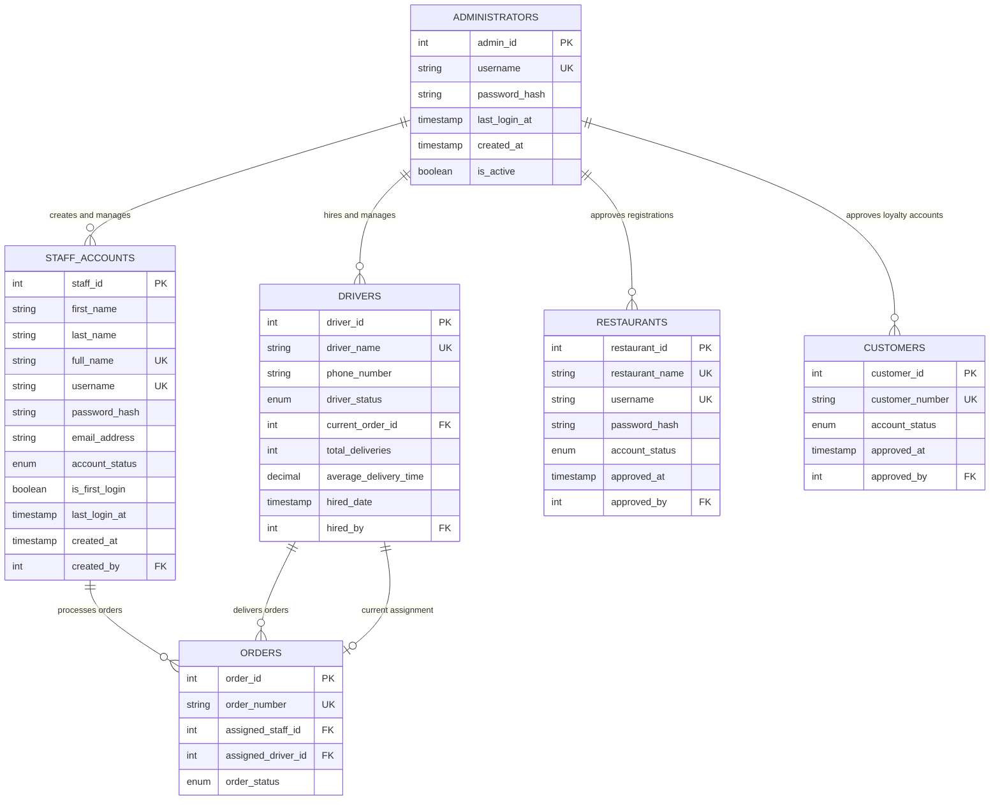
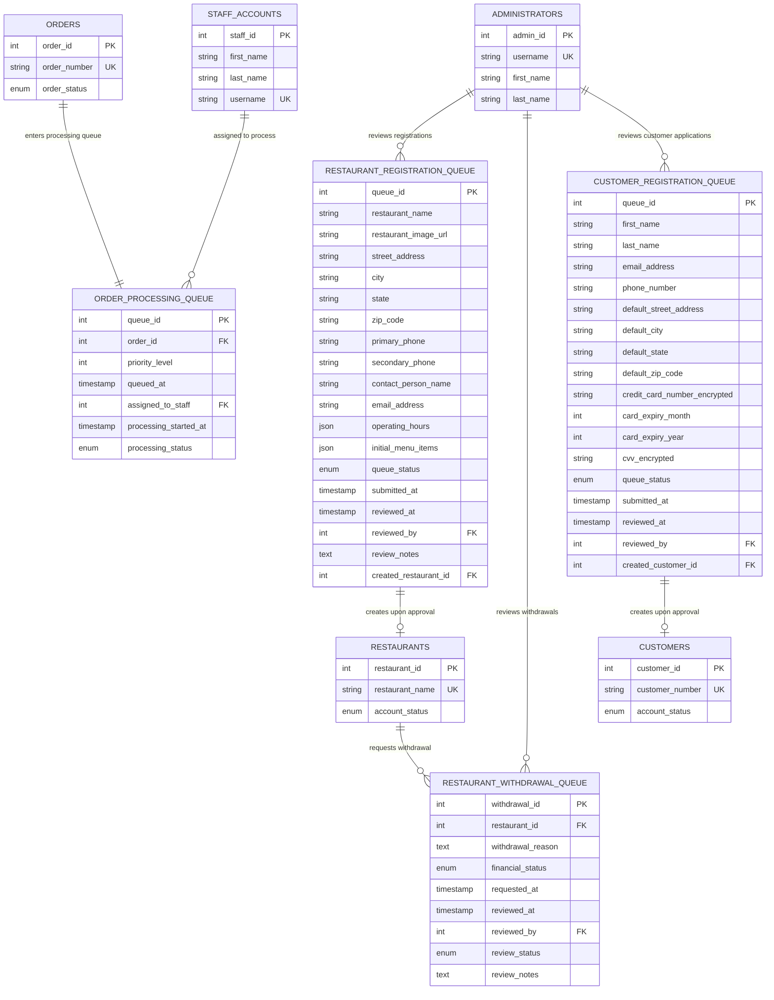
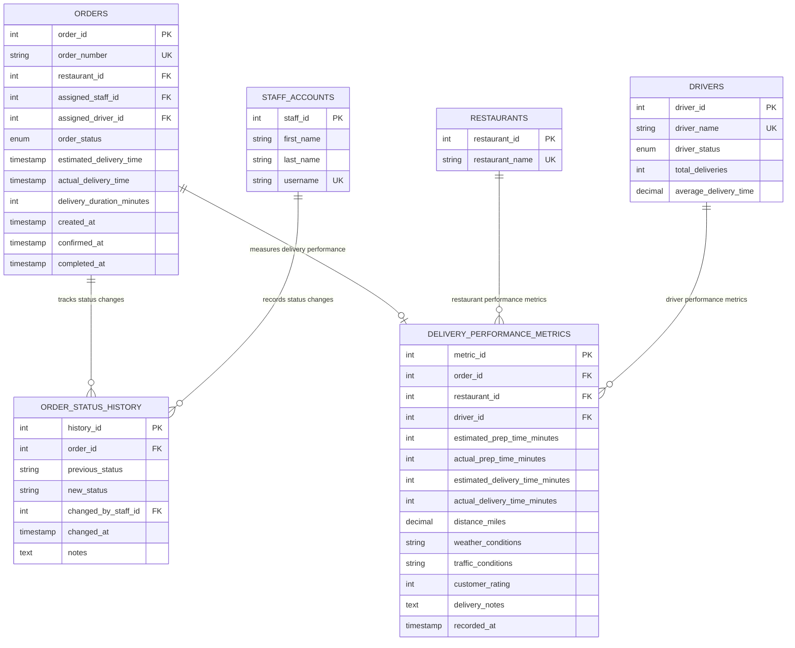

# FrontDash Database Design Document

## Executive Summary

This document presents the complete database design for the FrontDash food delivery web application. The design supports a three-sided marketplace connecting restaurants, customers, and delivery operations through a queue-based processing system with role-based access control.

## Table of Contents

1. [Project Overview](#project-overview)
2. [Database Architecture](#database-architecture)
3. [Entity Identification](#entity-identification)
4. [Detailed Table Schemas](#detailed-table-schemas)
5. [Entity Relationship Diagram](#entity-relationship-diagram)
6. [Relationship Documentation](#relationship-documentation)
7. [Queue Management Strategy](#queue-management-strategy)
8. [Security Implementation](#security-implementation)
9. [Bonus Features Integration](#bonus-features-integration)
10. [Constraints and Business Rules](#constraints-and-business-rules)

## Project Overview

FrontDash is a comprehensive food delivery platform facilitating connections between restaurants and customers through efficient delivery services. The system manages restaurant registration and menu operations, customer ordering processes, and administrative oversight through independent yet interconnected components.

### Key Stakeholders
- **Restaurants**: Register, manage menus, operating hours, and order fulfillment
- **Customers**: Browse restaurants, place orders without account requirements
- **FrontDash Staff**: Process orders, coordinate deliveries, track performance metrics
- **FrontDash Administrators**: Manage platform operations, approve registrations, oversee staff
- **Drivers**: Execute deliveries and report completion metrics

### Core Business Requirements
- Queue-based processing for registrations, withdrawals, and orders
- Independent component operation with concurrent usage capability
- Real-time delivery time estimation and performance tracking
- Comprehensive audit trails and security implementation
- Optional customer loyalty program with points-based rewards

## Database Architecture

The database employs a relational model optimized for ACID compliance and concurrent operations. The design separates operational data from queue management systems while maintaining referential integrity across all components.

### Design Principles
- **Normalization**: Tables normalized to 3NF to eliminate redundancy
- **Scalability**: Indexed foreign keys and optimized query patterns
- **Security**: Encrypted password storage and audit logging
- **Flexibility**: Extensible schema for future feature additions
- **Performance**: Strategic denormalization for frequently accessed data

## Entity Identification

### Core Entities
1. **Restaurants** - Primary business partners with complete profile management
2. **Menu Items** - Individual food offerings with availability and pricing
3. **Orders** - Customer purchase transactions with complete audit trails
4. **Order Items** - Junction entity linking orders to specific menu items
5. **Customers** - Optional accounts for loyalty program participation
6. **Staff Accounts** - FrontDash employees processing orders and operations
7. **Drivers** - Delivery personnel executing order fulfillment
8. **Administrators** - Platform managers with full system access

### Queue Management Entities
1. **Restaurant Registration Queue** - Pending restaurant applications
2. **Restaurant Withdrawal Queue** - Withdrawal requests awaiting approval
3. **Order Processing Queue** - Customer orders awaiting staff assignment
4. **Customer Registration Queue** - Loyalty program applications (bonus feature)

### Supporting Entities
1. **Order Status History** - Audit trail for order state changes
2. **Staff Sessions** - Authentication and session management
3. **Delivery Performance** - Metrics tracking for time estimation optimization

## Detailed Table Schemas

### 1. Restaurants Table

```sql
CREATE TABLE restaurants (
    restaurant_id SERIAL PRIMARY KEY,
    restaurant_name VARCHAR(255) NOT NULL UNIQUE,
    restaurant_image_url VARCHAR(500),
    street_address TEXT NOT NULL,
    city VARCHAR(100) NOT NULL,
    state VARCHAR(50) NOT NULL,
    zip_code VARCHAR(10) NOT NULL,
    primary_phone VARCHAR(10) NOT NULL,
    secondary_phone VARCHAR(10),
    contact_person_name VARCHAR(100) NOT NULL,
    email_address VARCHAR(255) NOT NULL UNIQUE,
    username VARCHAR(50) UNIQUE,
    password_hash VARCHAR(255),
    account_status ENUM('PENDING', 'ACTIVE', 'SUSPENDED', 'WITHDRAWN') DEFAULT 'PENDING',
    created_at TIMESTAMP DEFAULT CURRENT_TIMESTAMP,
    updated_at TIMESTAMP DEFAULT CURRENT_TIMESTAMP ON UPDATE CURRENT_TIMESTAMP,
    approved_at TIMESTAMP NULL,
    approved_by INT REFERENCES administrators(admin_id)
);
```

**Business Rules**:
- Restaurant names must be unique across the platform
- Phone numbers validated as 10 digits with first digit non-zero
- Email addresses must be unique and properly formatted
- Account status tracks the restaurant's current platform standing

### 2. Restaurant Operating Hours Table

```sql
CREATE TABLE restaurant_operating_hours (
    hours_id SERIAL PRIMARY KEY,
    restaurant_id INT NOT NULL REFERENCES restaurants(restaurant_id) ON DELETE CASCADE,
    day_of_week ENUM('MONDAY', 'TUESDAY', 'WEDNESDAY', 'THURSDAY', 'FRIDAY', 'SATURDAY', 'SUNDAY') NOT NULL,
    opening_time TIME,
    closing_time TIME,
    is_closed BOOLEAN DEFAULT FALSE,
    created_at TIMESTAMP DEFAULT CURRENT_TIMESTAMP,
    updated_at TIMESTAMP DEFAULT CURRENT_TIMESTAMP ON UPDATE CURRENT_TIMESTAMP,
    UNIQUE(restaurant_id, day_of_week)
);
```

**Business Rules**:
- Each restaurant must have exactly seven records (one per day)
- Opening and closing times can be NULL if restaurant is closed that day
- Times stored in 24-hour format for consistency

### 3. Menu Items Table

```sql
CREATE TABLE menu_items (
    item_id SERIAL PRIMARY KEY,
    restaurant_id INT NOT NULL REFERENCES restaurants(restaurant_id) ON DELETE CASCADE,
    item_name VARCHAR(255) NOT NULL,
    item_description TEXT,
    item_image_url VARCHAR(500),
    item_price DECIMAL(10,2) NOT NULL CHECK (item_price > 0),
    availability_status ENUM('AVAILABLE', 'UNAVAILABLE') DEFAULT 'AVAILABLE',
    created_at TIMESTAMP DEFAULT CURRENT_TIMESTAMP,
    updated_at TIMESTAMP DEFAULT CURRENT_TIMESTAMP ON UPDATE CURRENT_TIMESTAMP,
    INDEX idx_restaurant_availability (restaurant_id, availability_status)
);
```

**Business Rules**:
- Item prices must be positive values
- Item names must be provided for all menu items
- Availability status controls customer visibility

### 4. Customers Table (Bonus Feature)

```sql
CREATE TABLE customers (
    customer_id SERIAL PRIMARY KEY,
    customer_number VARCHAR(20) UNIQUE,
    first_name VARCHAR(50) NOT NULL,
    last_name VARCHAR(50) NOT NULL,
    email_address VARCHAR(255) NOT NULL UNIQUE,
    phone_number VARCHAR(10) NOT NULL,
    default_street_address TEXT NOT NULL,
    default_city VARCHAR(100) NOT NULL,
    default_state VARCHAR(50) NOT NULL,
    default_zip_code VARCHAR(10) NOT NULL,
    credit_card_number_encrypted VARCHAR(255),
    card_expiry_month INT CHECK (card_expiry_month BETWEEN 1 AND 12),
    card_expiry_year INT CHECK (card_expiry_year >= YEAR(CURDATE())),
    cvv_encrypted VARCHAR(255),
    loyalty_points INT DEFAULT 0 CHECK (loyalty_points >= 0),
    account_status ENUM('PENDING', 'ACTIVE', 'SUSPENDED') DEFAULT 'PENDING',
    created_at TIMESTAMP DEFAULT CURRENT_TIMESTAMP,
    approved_at TIMESTAMP NULL,
    approved_by INT REFERENCES administrators(admin_id)
);
```

**Business Rules**:
- Customer numbers are system-generated unique identifiers
- Credit card information stored with encryption
- Loyalty points cannot be negative

### 5. Orders Table

```sql
CREATE TABLE orders (
    order_id SERIAL PRIMARY KEY,
    order_number VARCHAR(20) UNIQUE NOT NULL,
    restaurant_id INT NOT NULL REFERENCES restaurants(restaurant_id),
    customer_id INT REFERENCES customers(customer_id),
    
    -- Customer Information (for non-registered customers)
    customer_first_name VARCHAR(50),
    customer_last_name VARCHAR(50),
    customer_email VARCHAR(255),
    customer_phone VARCHAR(10),
    
    -- Delivery Information
    delivery_street_address TEXT NOT NULL,
    delivery_city VARCHAR(100) NOT NULL,
    delivery_state VARCHAR(50) NOT NULL,
    delivery_zip_code VARCHAR(10) NOT NULL,
    delivery_contact_name VARCHAR(100) NOT NULL,
    delivery_contact_phone VARCHAR(10) NOT NULL,
    
    -- Order Amounts
    subtotal_amount DECIMAL(10,2) NOT NULL CHECK (subtotal_amount > 0),
    service_charge DECIMAL(10,2) NOT NULL DEFAULT 0,
    tip_amount DECIMAL(10,2) DEFAULT 0,
    loyalty_discount DECIMAL(10,2) DEFAULT 0,
    grand_total DECIMAL(10,2) NOT NULL CHECK (grand_total > 0),
    
    -- Payment Information
    payment_card_type VARCHAR(50) NOT NULL,
    payment_card_last_four VARCHAR(4) NOT NULL,
    payment_status ENUM('PENDING', 'VERIFIED', 'FAILED', 'REFUNDED') DEFAULT 'PENDING',
    
    -- Order Status and Timing
    order_status ENUM('PLACED', 'CONFIRMED', 'PREPARING', 'READY_FOR_PICKUP', 'OUT_FOR_DELIVERY', 'DELIVERED', 'CANCELLED') DEFAULT 'PLACED',
    estimated_delivery_time TIMESTAMP,
    actual_delivery_time TIMESTAMP,
    delivery_duration_minutes INT,
    
    -- Assignment and Processing
    assigned_staff_id INT REFERENCES staff_accounts(staff_id),
    assigned_driver_id INT REFERENCES drivers(driver_id),
    
    -- Audit Timestamps
    created_at TIMESTAMP DEFAULT CURRENT_TIMESTAMP,
    confirmed_at TIMESTAMP,
    completed_at TIMESTAMP,
    
    INDEX idx_order_status (order_status),
    INDEX idx_restaurant_date (restaurant_id, created_at),
    INDEX idx_staff_assignment (assigned_staff_id),
    INDEX idx_delivery_tracking (order_status, estimated_delivery_time)
);
```

**Business Rules**:
- Order numbers are system-generated unique identifiers
- Either customer_id OR customer contact information must be provided
- Service charge calculated as 8.25% of subtotal
- Grand total must equal subtotal + service charge + tip - loyalty discount

### 6. Order Items Table

```sql
CREATE TABLE order_items (
    order_item_id SERIAL PRIMARY KEY,
    order_id INT NOT NULL REFERENCES orders(order_id) ON DELETE CASCADE,
    menu_item_id INT NOT NULL REFERENCES menu_items(item_id),
    item_name VARCHAR(255) NOT NULL, -- Snapshot for historical accuracy
    item_price DECIMAL(10,2) NOT NULL, -- Price at time of order
    quantity INT NOT NULL CHECK (quantity > 0),
    subtotal DECIMAL(10,2) NOT NULL CHECK (subtotal > 0),
    created_at TIMESTAMP DEFAULT CURRENT_TIMESTAMP,
    INDEX idx_order_items (order_id)
);
```

**Business Rules**:
- Quantity must be positive
- Subtotal calculated as item_price × quantity
- Item name and price captured for historical accuracy

### 7. Staff Accounts Table

```sql
CREATE TABLE staff_accounts (
    staff_id SERIAL PRIMARY KEY,
    first_name VARCHAR(50) NOT NULL,
    last_name VARCHAR(50) NOT NULL,
    full_name VARCHAR(101) GENERATED ALWAYS AS (CONCAT(first_name, ' ', last_name)) STORED UNIQUE,
    username VARCHAR(50) UNIQUE NOT NULL,
    password_hash VARCHAR(255) NOT NULL,
    email_address VARCHAR(255),
    account_status ENUM('ACTIVE', 'INACTIVE', 'SUSPENDED') DEFAULT 'ACTIVE',
    is_first_login BOOLEAN DEFAULT TRUE,
    last_login_at TIMESTAMP,
    created_at TIMESTAMP DEFAULT CURRENT_TIMESTAMP,
    created_by INT NOT NULL REFERENCES administrators(admin_id),
    INDEX idx_username (username),
    INDEX idx_status (account_status)
);
```

**Business Rules**:
- Full names must be unique across all staff
- Username format: lastname + 2 digits (auto-generated)
- Initial password auto-generated, must be changed on first login

### 8. Drivers Table

```sql
CREATE TABLE drivers (
    driver_id SERIAL PRIMARY KEY,
    driver_name VARCHAR(100) NOT NULL UNIQUE,
    phone_number VARCHAR(10),
    driver_status ENUM('AVAILABLE', 'BUSY', 'OFFLINE', 'SUSPENDED') DEFAULT 'AVAILABLE',
    current_order_id INT REFERENCES orders(order_id),
    total_deliveries INT DEFAULT 0,
    average_delivery_time DECIMAL(5,2),
    hired_date TIMESTAMP DEFAULT CURRENT_TIMESTAMP,
    hired_by INT NOT NULL REFERENCES administrators(admin_id),
    INDEX idx_driver_status (driver_status)
);
```

**Business Rules**:
- Driver names must be unique
- Only one driver can be assigned to an order at a time
- Status tracking for efficient order assignment

### 9. Administrators Table

```sql
CREATE TABLE administrators (
    admin_id SERIAL PRIMARY KEY,
    username VARCHAR(50) UNIQUE NOT NULL DEFAULT 'admin',
    password_hash VARCHAR(255) NOT NULL,
    first_name VARCHAR(50) NOT NULL,
    last_name VARCHAR(50) NOT NULL,
    email_address VARCHAR(255) NOT NULL,
    last_login_at TIMESTAMP,
    created_at TIMESTAMP DEFAULT CURRENT_TIMESTAMP,
    is_active BOOLEAN DEFAULT TRUE
);
```

**Business Rules**:
- Single hardcoded administrator account
- Username defaults to 'admin'
- Account cannot be deleted, only deactivated

### 10. Restaurant Registration Queue Table

```sql
CREATE TABLE restaurant_registration_queue (
    queue_id SERIAL PRIMARY KEY,
    restaurant_name VARCHAR(255) NOT NULL,
    restaurant_image_url VARCHAR(500),
    street_address TEXT NOT NULL,
    city VARCHAR(100) NOT NULL,
    state VARCHAR(50) NOT NULL,
    zip_code VARCHAR(10) NOT NULL,
    primary_phone VARCHAR(10) NOT NULL,
    secondary_phone VARCHAR(10),
    contact_person_name VARCHAR(100) NOT NULL,
    email_address VARCHAR(255) NOT NULL,
    
    -- Operating Hours JSON
    operating_hours JSON NOT NULL,
    
    -- Initial Menu Items JSON
    initial_menu_items JSON NOT NULL,
    
    -- Queue Management
    queue_status ENUM('PENDING', 'APPROVED', 'REJECTED') DEFAULT 'PENDING',
    submitted_at TIMESTAMP DEFAULT CURRENT_TIMESTAMP,
    reviewed_at TIMESTAMP,
    reviewed_by INT REFERENCES administrators(admin_id),
    review_notes TEXT,
    
    -- Link to created restaurant (if approved)
    created_restaurant_id INT REFERENCES restaurants(restaurant_id),
    
    INDEX idx_queue_status (queue_status),
    INDEX idx_submission_date (submitted_at)
);
```

**Business Rules**:
- Queue processed in FIFO order based on submitted_at
- Operating hours and menu items stored as JSON for flexibility
- Links to created restaurant record upon approval

### 11. Restaurant Withdrawal Queue Table

```sql
CREATE TABLE restaurant_withdrawal_queue (
    withdrawal_id SERIAL PRIMARY KEY,
    restaurant_id INT NOT NULL REFERENCES restaurants(restaurant_id),
    withdrawal_reason TEXT NOT NULL,
    financial_status ENUM('SETTLED', 'PENDING_PAYMENT', 'DISPUTED') NOT NULL,
    requested_at TIMESTAMP DEFAULT CURRENT_TIMESTAMP,
    reviewed_at TIMESTAMP,
    reviewed_by INT REFERENCES administrators(admin_id),
    review_status ENUM('PENDING', 'APPROVED', 'DENIED') DEFAULT 'PENDING',
    review_notes TEXT,
    INDEX idx_review_status (review_status),
    INDEX idx_request_date (requested_at)
);
```

**Business Rules**:
- Restaurants can only have one pending withdrawal request
- Financial status must be verified before approval
- Approval results in restaurant account deactivation

### 12. Order Processing Queue Table

```sql
CREATE TABLE order_processing_queue (
    queue_id SERIAL PRIMARY KEY,
    order_id INT NOT NULL UNIQUE REFERENCES orders(order_id),
    priority_level INT DEFAULT 1,
    queued_at TIMESTAMP DEFAULT CURRENT_TIMESTAMP,
    assigned_to_staff INT REFERENCES staff_accounts(staff_id),
    processing_started_at TIMESTAMP,
    processing_status ENUM('QUEUED', 'PROCESSING', 'COMPLETED', 'CANCELLED') DEFAULT 'QUEUED',
    INDEX idx_queue_order (priority_level DESC, queued_at ASC),
    INDEX idx_staff_assignment (assigned_to_staff)
);
```

**Business Rules**:
- Orders processed in FIFO order unless priority assigned
- Only one staff member can process an order at a time
- Queue entry removed upon order completion

### 13. Customer Registration Queue Table (Bonus Feature)

```sql
CREATE TABLE customer_registration_queue (
    queue_id SERIAL PRIMARY KEY,
    first_name VARCHAR(50) NOT NULL,
    last_name VARCHAR(50) NOT NULL,
    email_address VARCHAR(255) NOT NULL,
    phone_number VARCHAR(10) NOT NULL,
    default_street_address TEXT NOT NULL,
    default_city VARCHAR(100) NOT NULL,
    default_state VARCHAR(50) NOT NULL,
    default_zip_code VARCHAR(10) NOT NULL,
    credit_card_number_encrypted VARCHAR(255) NOT NULL,
    card_expiry_month INT NOT NULL,
    card_expiry_year INT NOT NULL,
    cvv_encrypted VARCHAR(255) NOT NULL,
    
    queue_status ENUM('PENDING', 'APPROVED', 'REJECTED') DEFAULT 'PENDING',
    submitted_at TIMESTAMP DEFAULT CURRENT_TIMESTAMP,
    reviewed_at TIMESTAMP,
    reviewed_by INT REFERENCES administrators(admin_id),
    
    created_customer_id INT REFERENCES customers(customer_id),
    
    INDEX idx_queue_status (queue_status),
    INDEX idx_submission_date (submitted_at)
);
```

### 14. Order Status History Table

```sql
CREATE TABLE order_status_history (
    history_id SERIAL PRIMARY KEY,
    order_id INT NOT NULL REFERENCES orders(order_id) ON DELETE CASCADE,
    previous_status VARCHAR(50),
    new_status VARCHAR(50) NOT NULL,
    changed_by_staff_id INT REFERENCES staff_accounts(staff_id),
    changed_at TIMESTAMP DEFAULT CURRENT_TIMESTAMP,
    notes TEXT,
    INDEX idx_order_history (order_id, changed_at)
);
```

### 15. Delivery Performance Metrics Table

```sql
CREATE TABLE delivery_performance_metrics (
    metric_id SERIAL PRIMARY KEY,
    order_id INT NOT NULL REFERENCES orders(order_id),
    restaurant_id INT NOT NULL REFERENCES restaurants(restaurant_id),
    driver_id INT REFERENCES drivers(driver_id),
    
    estimated_prep_time_minutes INT,
    actual_prep_time_minutes INT,
    estimated_delivery_time_minutes INT,
    actual_delivery_time_minutes INT,
    
    distance_miles DECIMAL(5,2),
    weather_conditions VARCHAR(100),
    traffic_conditions VARCHAR(100),
    
    customer_rating INT CHECK (customer_rating BETWEEN 1 AND 5),
    delivery_notes TEXT,
    
    recorded_at TIMESTAMP DEFAULT CURRENT_TIMESTAMP,
    
    INDEX idx_performance_analysis (restaurant_id, recorded_at),
    INDEX idx_driver_performance (driver_id, recorded_at)
);
```

## Entity Relationship Diagrams

To ensure readability and proper PDF formatting, the complete database design is presented through four focused diagrams, each highlighting a specific domain area of the FrontDash system.

### 5.1 Core Business Entities Diagram

This diagram illustrates the heart of the FrontDash business model, showing how restaurants, their menus, and customer orders interconnect to form the primary transaction flow.



### 5.2 User Management and Administration Diagram

This diagram focuses on the administrative structure of FrontDash, showing how administrators manage staff accounts and drivers, along with the authentication relationships that secure the system.



### 5.3 Queue Management System Diagram

This diagram illustrates the queue-based workflow system that manages all approval processes and order processing within FrontDash, ensuring proper FIFO processing and administrative oversight.



### 5.4 Performance Tracking and Audit System Diagram

This diagram shows the comprehensive audit trail and performance measurement system that enables FrontDash to track delivery efficiency and maintain detailed operational records.



## Relationship Documentation

### One-to-Many Relationships

**Restaurants to Restaurant Operating Hours (1:7)**
- Each restaurant must have exactly seven operating hour records (one per day of week)
- Cascade delete ensures hours are removed when restaurant is deleted
- Unique constraint prevents duplicate day entries per restaurant

**Restaurants to Menu Items (1:N)**
- Each restaurant can have unlimited menu items
- Menu items cannot exist without a restaurant
- Availability status controls customer visibility

**Restaurants to Orders (1:N)**
- Each restaurant can receive unlimited orders
- Orders maintain restaurant reference for historical accuracy
- Foreign key constraint ensures order integrity

**Orders to Order Items (1:N)**
- Each order contains one or more order items
- Order items cannot exist independently
- Cascade delete maintains referential integrity

**Menu Items to Order Items (1:N)**
- Menu items can appear in multiple orders
- Order items capture menu item details at time of order
- Historical pricing preserved through snapshotting

### Many-to-One Relationships

**Orders to Customers (N:1)**
- Customers can place multiple orders
- Customer reference is optional (supports guest checkout)
- Loyalty points calculated from order totals

**Orders to Staff Accounts (N:1)**
- Staff members can process multiple orders
- Order assignment tracked for performance metrics
- Optional relationship until order enters processing queue

**Orders to Drivers (N:1)**
- Drivers can deliver multiple orders
- Current order assignment prevents double-booking
- Delivery performance metrics linked to driver

### Administrative Relationships

**Administrators to Multiple Entities (1:N)**
- Administrators approve restaurant registrations
- Administrators create staff accounts with auto-generated credentials
- Administrators hire and fire drivers
- Administrators approve customer loyalty registrations

### Queue Management Relationships

**Queue to Entity Creation (1:1)**
- Each queue entry can create at most one entity upon approval
- Queue entries maintain links to created entities
- Processing status prevents duplicate approvals

## Queue Management Strategy

### Queue Processing Order

**First-In-First-Out (FIFO) Implementation**
All queues implement FIFO processing based on submission timestamps with provisions for priority overrides in critical situations.

```sql
-- Example FIFO query for restaurant registration queue
SELECT * FROM restaurant_registration_queue 
WHERE queue_status = 'PENDING' 
ORDER BY submitted_at ASC 
LIMIT 1;
```

### Queue Status Management

**Restaurant Registration Queue**
- PENDING: Awaiting administrative review
- APPROVED: Restaurant account created, credentials sent
- REJECTED: Application declined with review notes

**Restaurant Withdrawal Queue**
- PENDING: Awaiting financial and operational review
- APPROVED: Restaurant account deactivated
- DENIED: Withdrawal request rejected (typically for financial reasons)

**Order Processing Queue**
- QUEUED: Order verified and awaiting staff assignment
- PROCESSING: Staff member assigned and processing order
- COMPLETED: Order dispatched for delivery
- CANCELLED: Order cancelled before processing

**Customer Registration Queue (Bonus)**
- PENDING: Awaiting verification and approval
- APPROVED: Customer account created, number assigned
- REJECTED: Registration declined

### Concurrency Control

**Queue Locking Mechanism**
Implement row-level locking to prevent multiple staff members from processing the same queue item simultaneously.

```sql
-- Example concurrent-safe queue retrieval
BEGIN;
SELECT * FROM order_processing_queue 
WHERE processing_status = 'QUEUED' 
ORDER BY priority_level DESC, queued_at ASC 
LIMIT 1 
FOR UPDATE SKIP LOCKED;
-- Process order
UPDATE order_processing_queue 
SET processing_status = 'PROCESSING', 
    assigned_to_staff = ?, 
    processing_started_at = NOW() 
WHERE queue_id = ?;
COMMIT;
```

## Security Implementation

### Password Security

**Encryption Standards**
All passwords stored using bcrypt hashing with minimum 12 rounds for computational security.

```sql
-- Password never stored in plain text
password_hash VARCHAR(255) NOT NULL -- Stores bcrypt hash
```

**Password Requirements Enforcement**
- Minimum 6 characters length
- At least one uppercase letter
- At least one lowercase letter
- At least one numeric digit
- No password display in any user interface

### Data Protection

**Sensitive Information Encryption**
Customer credit card information encrypted using AES-256 before database storage.

```sql
credit_card_number_encrypted VARCHAR(255) -- AES-256 encrypted
cvv_encrypted VARCHAR(255) -- AES-256 encrypted
```

**Personal Identifiable Information (PII) Handling**
- Email addresses unique across customer and restaurant tables
- Phone numbers validated for proper format
- Address information stored with proper normalization

### Access Control

**Role-Based Security**
- Administrators: Full system access
- Staff: Order processing and limited customer data access
- Restaurants: Own account and menu management only
- Customers: Own order history and loyalty account access

**Session Management**
User sessions tracked with secure token generation and automatic timeout policies.

## Bonus Features Integration

### Customer Loyalty Program

**Points Accumulation System**
- 1 point earned per dollar spent (calculated from subtotal before service charges and tips)
- Points automatically added upon order completion
- Points balance tracked in real-time

**Discount Redemption System**
- 10% discount available when customer has 100+ points
- 100 points automatically deducted upon discount application
- Discount amount recorded in orders table for audit purposes

**Customer Registration Workflow**
1. Customer submits registration through web form
2. Registration enters admin approval queue
3. Administrator reviews and approves/rejects
4. Approved customers receive unique customer number via email
5. Customer can use number for future orders to accumulate points

### Spring Security Implementation (Additional Bonus)

**Authentication Framework**
Role-based authentication with JWT token management for secure session handling across all user types.

**Authorization Matrix**
- Public endpoints: Restaurant browsing, menu viewing, order placement
- Restaurant endpoints: Account management, menu editing, hours management
- Staff endpoints: Order processing, driver assignment, delivery tracking
- Administrator endpoints: All approval queues, staff management, driver management

## Constraints and Business Rules

### Data Integrity Constraints

**Referential Integrity**
- All foreign key relationships enforced with appropriate cascade rules
- Orphaned records prevented through proper constraint definitions
- Cross-table validation rules implemented via triggers

**Business Rule Validation**
- Phone numbers: Exactly 10 digits, first digit non-zero
- Credit card numbers: Exactly 16 digits, first digit non-zero
- Email addresses: Proper format validation via CHECK constraints
- Names: Minimum 2 letters for first and last names

### Operational Constraints

**Concurrent Operations**
- Multiple customers can place orders simultaneously
- Restaurant staff can update menus while orders are being processed
- Administrative operations do not block customer or restaurant operations

**Data Consistency**
- Order totals automatically calculated and validated
- Menu item availability affects customer ordering capabilities
- Restaurant operating hours control order acceptance timing

### Performance Optimization

**Indexing Strategy**
- Primary keys automatically indexed
- Foreign keys indexed for join performance
- Composite indexes on frequently queried combinations
- Partial indexes on status fields for queue processing

**Query Optimization**
- Materialized views for complex reporting queries
- Denormalized fields for frequently accessed calculations
- Appropriate use of JSON columns for flexible data storage

## Conclusion

This comprehensive database design supports all FrontDash requirements including core functionality, bonus features, and operational scalability. The design emphasizes data integrity, security, and performance while maintaining flexibility for future enhancements.

The queue-based architecture ensures proper workflow management while the independent component design allows concurrent operations across all user types. Security implementation meets industry standards for sensitive data protection and user authentication.

The schema supports both immediate operational needs and long-term analytical requirements through comprehensive audit trails and performance metrics collection.