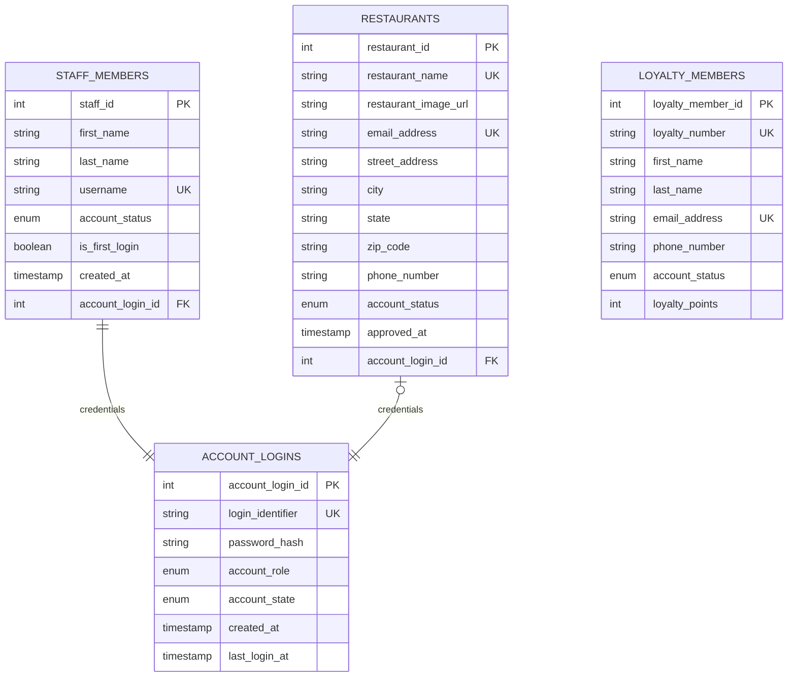
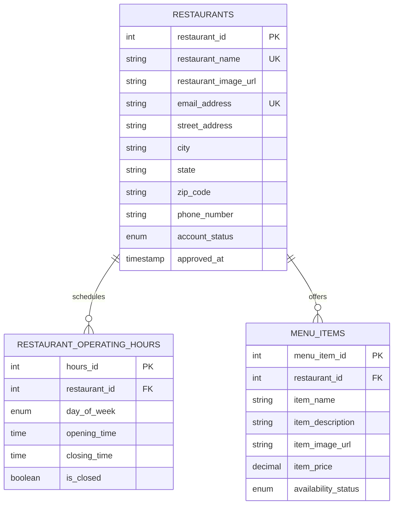
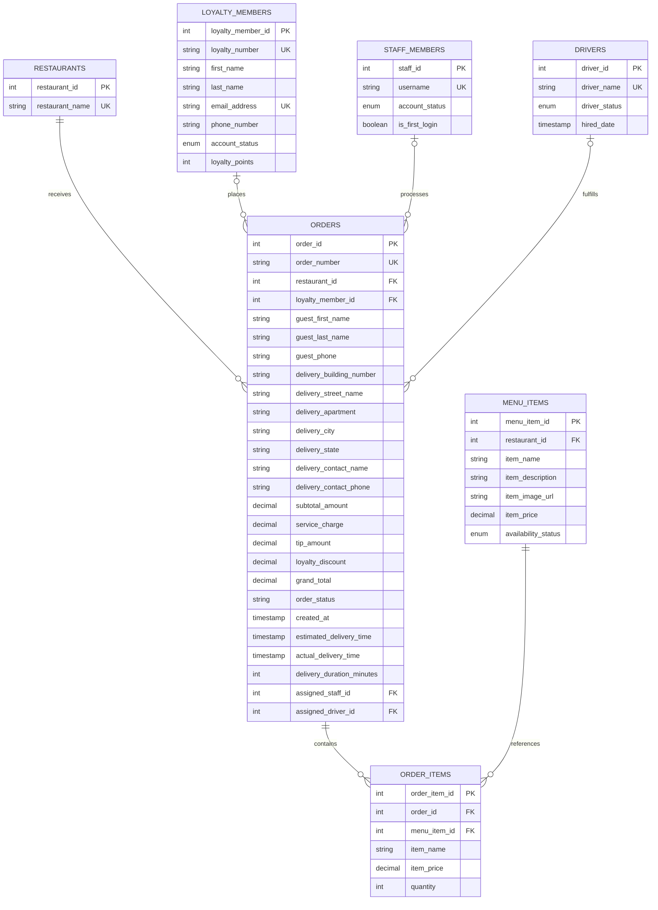
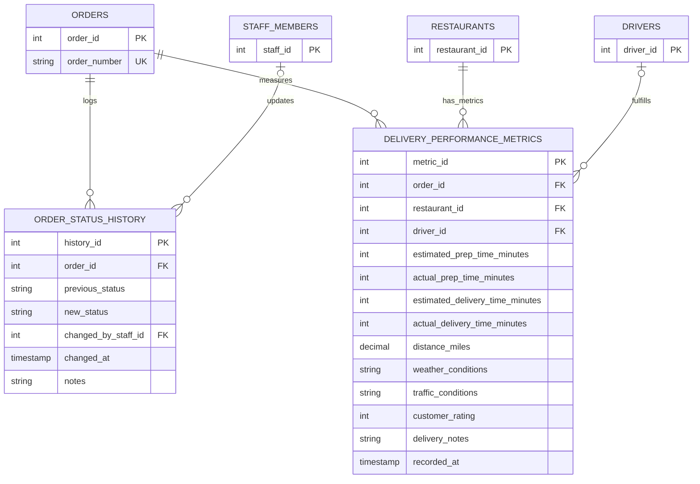

# FrontDash Database Design Document

## Executive Summary

This document presents the complete database design for the FrontDash food delivery web application. The design supports a three-sided marketplace connecting restaurants, customers, and delivery operations through status-driven workflows with role-based access control.

## Table of Contents

1. [Project Overview](#project-overview)
2. [Database Architecture](#database-architecture)
3. [Entity Identification](#entity-identification)
4. [Detailed Table Schemas](#detailed-table-schemas)
5. [Entity Relationship Diagrams](#entity-relationship-diagrams)
6. [Relationship Documentation](#relationship-documentation)
7. [Security Implementation](#security-implementation)
8. [Bonus Features Integration](#bonus-features-integration)
9. [Constraints and Business Rules](#constraints-and-business-rules)

## Project Overview

FrontDash is a comprehensive food delivery platform facilitating connections between restaurants and customers through efficient delivery services. The system manages restaurant registration and menu operations, customer ordering processes, and administrative oversight through independent yet interconnected components.

### Key Stakeholders
- **Restaurants**: Register, manage menus, operating hours, and order fulfillment
- **Customers**: Browse restaurants, place orders without account requirements
- **FrontDash Staff**: Process orders, coordinate deliveries, track performance metrics
- **FrontDash Administrators**: Manage platform operations, approve registrations, oversee staff
- **Drivers**: Execute deliveries and report completion metrics

### Core Business Requirements
- Status-driven processing for registrations, withdrawals, and orders
- Independent component operation with concurrent usage capability
- Real-time delivery time estimation and performance tracking
- Comprehensive audit trails and security implementation
- Optional customer loyalty program with points-based rewards

## Database Architecture

The database employs a relational model optimized for ACID compliance and concurrent operations. The design maintains normalized operational data while relying on status transitions within core tables for approvals and workflow progression.

### Design Principles
- **Normalization**: Tables normalized to 3NF to eliminate redundancy
- **Scalability**: Indexed foreign keys and optimized query patterns
- **Security**: Encrypted password storage and audit logging
- **Flexibility**: Extensible schema for future feature additions
- **Performance**: Strategic denormalization for frequently accessed data

## Entity Identification

### Core Entities
1. **Restaurants** - Primary business partners with complete profile management
2. **Menu Items** - Individual food offerings with availability and pricing
3. **Orders** - Customer purchase transactions with complete audit trails
4. **Order Items** - Junction entity linking orders to specific menu items
5. **Loyalty Members** - Optional accounts for loyalty program participation
6. **Staff Accounts** - FrontDash employees processing orders and operations
7. **Drivers** - Delivery personnel executing order fulfillment
8. **Account Logins** - Shared credential store for staff and restaurant logins

### Supporting Entities
1. **Order Status History** - Audit trail for order state changes
2. **Staff Sessions** - Authentication and session management
3. **Delivery Performance** - Metrics tracking for time estimation optimization

## Detailed Table Schemas

### 1. Restaurants Table

```sql
CREATE TABLE restaurants (
    restaurant_id SERIAL PRIMARY KEY,
    restaurant_name VARCHAR(255) NOT NULL UNIQUE,
    restaurant_image_url VARCHAR(500),
    street_address TEXT NOT NULL,
    city VARCHAR(100) NOT NULL,
    state VARCHAR(50) NOT NULL,
    zip_code VARCHAR(10) NOT NULL,
    phone_number VARCHAR(10) NOT NULL,
    email_address VARCHAR(255) NOT NULL UNIQUE,
    account_status ENUM('PENDING', 'ACTIVE', 'SUSPENDED', 'WITHDRAWN') DEFAULT 'PENDING',
    account_login_id INT REFERENCES account_logins(account_login_id),
    created_at TIMESTAMP DEFAULT CURRENT_TIMESTAMP,
    updated_at TIMESTAMP DEFAULT CURRENT_TIMESTAMP ON UPDATE CURRENT_TIMESTAMP,
    approved_at TIMESTAMP NULL
);
```

**Business Rules**:
- Restaurant names must be unique across the platform
- Phone numbers validated as 10 digits with first digit non-zero
- Email addresses must be unique and properly formatted
-- Account status tracks the restaurant's current platform standing

### 2. Restaurant Operating Hours Table

```sql
CREATE TABLE restaurant_operating_hours (
    hours_id SERIAL PRIMARY KEY,
    restaurant_id INT NOT NULL REFERENCES restaurants(restaurant_id) ON DELETE CASCADE,
    day_of_week ENUM('MONDAY', 'TUESDAY', 'WEDNESDAY', 'THURSDAY', 'FRIDAY', 'SATURDAY', 'SUNDAY') NOT NULL,
    opening_time TIME,
    closing_time TIME,
    is_closed BOOLEAN DEFAULT FALSE,
    created_at TIMESTAMP DEFAULT CURRENT_TIMESTAMP,
    updated_at TIMESTAMP DEFAULT CURRENT_TIMESTAMP ON UPDATE CURRENT_TIMESTAMP,
    UNIQUE(restaurant_id, day_of_week)
);
```

**Business Rules**:
- Each restaurant must have exactly seven records (one per day)
- Opening and closing times can be NULL if restaurant is closed that day
- Times stored in 24-hour format for consistency

### 3. Menu Items Table

```sql
CREATE TABLE menu_items (
    item_id SERIAL PRIMARY KEY,
    restaurant_id INT NOT NULL REFERENCES restaurants(restaurant_id) ON DELETE CASCADE,
    item_name VARCHAR(255) NOT NULL,
    item_description TEXT,
    item_image_url VARCHAR(500),
    item_price DECIMAL(10,2) NOT NULL CHECK (item_price > 0),
    availability_status ENUM('AVAILABLE', 'UNAVAILABLE') DEFAULT 'AVAILABLE',
    created_at TIMESTAMP DEFAULT CURRENT_TIMESTAMP,
    updated_at TIMESTAMP DEFAULT CURRENT_TIMESTAMP ON UPDATE CURRENT_TIMESTAMP,
    INDEX idx_restaurant_availability (restaurant_id, availability_status)
);
```

**Business Rules**:
- Item prices must be positive values
- Item names must be provided for all menu items
- Availability status controls customer visibility

### 4. Loyalty Members Table (Bonus Feature)

```sql
CREATE TABLE loyalty_members (
    loyalty_member_id SERIAL PRIMARY KEY,
    loyalty_number VARCHAR(20) UNIQUE,
    first_name VARCHAR(50) NOT NULL,
    last_name VARCHAR(50) NOT NULL,
    email_address VARCHAR(255) NOT NULL UNIQUE,
    phone_number VARCHAR(10) NOT NULL,
    default_street_address TEXT NOT NULL,
    default_city VARCHAR(100) NOT NULL,
    default_state VARCHAR(50) NOT NULL,
    default_zip_code VARCHAR(10) NOT NULL,
    payment_token VARCHAR(255),
    card_expiry_month INT CHECK (card_expiry_month BETWEEN 1 AND 12),
    card_expiry_year INT CHECK (card_expiry_year >= YEAR(CURDATE())),
    loyalty_points INT DEFAULT 0 CHECK (loyalty_points >= 0),
    account_status ENUM('PENDING', 'ACTIVE', 'SUSPENDED') DEFAULT 'PENDING',
    created_at TIMESTAMP DEFAULT CURRENT_TIMESTAMP,
    approved_at TIMESTAMP NULL
);
```

**Business Rules**:
- Loyalty numbers are system-generated unique identifiers
- Card data is stored as a third-party token; no PAN or CVV values are retained
- Loyalty points cannot be negative
- Loyalty members authenticate using their loyalty number only; no application login is created

### 5. Auth Accounts Table

```sql
CREATE TABLE account_logins (
    account_login_id SERIAL PRIMARY KEY,
    login_identifier VARCHAR(100) NOT NULL UNIQUE,
    password_hash VARCHAR(255) NOT NULL,
    account_role ENUM('STAFF', 'RESTAURANT') NOT NULL,
    account_state ENUM('ACTIVE', 'LOCKED', 'DISABLED') DEFAULT 'ACTIVE',
    created_at TIMESTAMP DEFAULT CURRENT_TIMESTAMP,
    last_login_at TIMESTAMP
);
```

**Business Rules**:
- Login identifiers are unique across all account types
- Password hashes are stored using bcrypt (minimum 12 rounds)
- Account state controls authentication availability (locks, disables, etc.)
- The single FrontDash administrator account is hard-coded in application configuration and does not appear in this table

### 6. Orders Table

```sql
CREATE TABLE orders (
    order_id SERIAL PRIMARY KEY,
    order_number VARCHAR(20) UNIQUE NOT NULL,
    restaurant_id INT NOT NULL REFERENCES restaurants(restaurant_id),
    loyalty_member_id INT REFERENCES loyalty_members(loyalty_member_id),
    
    -- Guest Information (for non-registered customers)
    customer_first_name VARCHAR(50),
    customer_last_name VARCHAR(50),
    customer_email VARCHAR(255),
    customer_phone VARCHAR(10),
    
    -- Delivery Information
    delivery_building_number VARCHAR(20) NOT NULL,
    delivery_street_name VARCHAR(255) NOT NULL,
    delivery_apartment VARCHAR(50),
    delivery_city VARCHAR(100) NOT NULL,
    delivery_state VARCHAR(50) NOT NULL,
    delivery_contact_name VARCHAR(100) NOT NULL,
    delivery_contact_phone VARCHAR(10) NOT NULL,
    
    -- Order Amounts
    subtotal_amount DECIMAL(10,2) NOT NULL CHECK (subtotal_amount > 0),
    service_charge DECIMAL(10,2) NOT NULL DEFAULT 0,
    tip_amount DECIMAL(10,2) DEFAULT 0,
    loyalty_discount DECIMAL(10,2) DEFAULT 0,
    grand_total DECIMAL(10,2) NOT NULL CHECK (grand_total > 0),

    -- Order Status and Timing
    order_status ENUM('PLACED', 'CONFIRMED', 'PREPARING', 'READY_FOR_PICKUP', 'OUT_FOR_DELIVERY', 'DELIVERED', 'CANCELLED') DEFAULT 'PLACED',
    estimated_delivery_time TIMESTAMP,
    actual_delivery_time TIMESTAMP,
    delivery_duration_minutes INT,
    
    -- Assignment and Processing
    assigned_staff_id INT REFERENCES staff_accounts(staff_id),
    assigned_driver_id INT REFERENCES drivers(driver_id),
    
    -- Audit Timestamps
    created_at TIMESTAMP DEFAULT CURRENT_TIMESTAMP,
    confirmed_at TIMESTAMP,
    completed_at TIMESTAMP,
    
    INDEX idx_order_status (order_status),
    INDEX idx_restaurant_date (restaurant_id, created_at),
    INDEX idx_staff_assignment (assigned_staff_id),
    INDEX idx_delivery_tracking (order_status, estimated_delivery_time)
);
```

**Business Rules**:
- Order numbers are system-generated unique identifiers
- Either loyalty_member_id OR guest contact information must be provided
- Service charge calculated as 8.25% of subtotal
- Grand total must equal subtotal + service charge + tip - loyalty discount
- Credit card verification occurs before order creation; no payment card data is stored in the orders table

### 7. Order Items Table

```sql
CREATE TABLE order_items (
    order_item_id SERIAL PRIMARY KEY,
    order_id INT NOT NULL REFERENCES orders(order_id) ON DELETE CASCADE,
    menu_item_id INT NOT NULL REFERENCES menu_items(item_id),
    item_name VARCHAR(255) NOT NULL, -- Snapshot for historical accuracy
    item_price DECIMAL(10,2) NOT NULL, -- Price at time of order
    quantity INT NOT NULL CHECK (quantity > 0),
    subtotal DECIMAL(10,2) NOT NULL CHECK (subtotal > 0),
    created_at TIMESTAMP DEFAULT CURRENT_TIMESTAMP,
    INDEX idx_order_items (order_id)
);
```

**Business Rules**:
- Quantity must be positive
- Subtotal calculated as item_price × quantity
- Item name and price captured for historical accuracy

### 8. Staff Accounts Table

```sql
CREATE TABLE staff_accounts (
    staff_id SERIAL PRIMARY KEY,
    first_name VARCHAR(50) NOT NULL,
    last_name VARCHAR(50) NOT NULL,
    username VARCHAR(50) UNIQUE NOT NULL,
    email_address VARCHAR(255),
    account_status ENUM('ACTIVE', 'INACTIVE', 'SUSPENDED') DEFAULT 'ACTIVE',
    account_login_id INT REFERENCES account_logins(account_login_id),
    is_first_login BOOLEAN DEFAULT TRUE,
    last_login_at TIMESTAMP,
    created_at TIMESTAMP DEFAULT CURRENT_TIMESTAMP,
    UNIQUE(first_name, last_name),
    INDEX idx_username (username),
    INDEX idx_status (account_status)
);
```

**Business Rules**:
- Full names must be unique across all staff accounts
- Username format: lastname + 2 digits (auto-generated)
- Initial password is auto-generated within `account_logins` and must be changed on first login

### 9. Drivers Table

```sql
CREATE TABLE drivers (
    driver_id SERIAL PRIMARY KEY,
    driver_name VARCHAR(100) NOT NULL UNIQUE,
    phone_number VARCHAR(10),
    driver_status ENUM('AVAILABLE', 'BUSY', 'OFFLINE', 'SUSPENDED') DEFAULT 'AVAILABLE',
    current_order_id INT REFERENCES orders(order_id),
    total_deliveries INT DEFAULT 0,
    average_delivery_time DECIMAL(5,2),
    hired_date TIMESTAMP DEFAULT CURRENT_TIMESTAMP,
    INDEX idx_driver_status (driver_status)
);
```

**Business Rules**:
- Driver names must be unique
- Only one driver can be assigned to an order at a time
- Status tracking for efficient order assignment

### 10. Order Status History Table

```sql
CREATE TABLE order_status_history (
    history_id SERIAL PRIMARY KEY,
    order_id INT NOT NULL REFERENCES orders(order_id) ON DELETE CASCADE,
    previous_status VARCHAR(50),
    new_status VARCHAR(50) NOT NULL,
    changed_by_staff_id INT REFERENCES staff_accounts(staff_id),
    changed_at TIMESTAMP DEFAULT CURRENT_TIMESTAMP,
    notes TEXT,
    INDEX idx_order_history (order_id, changed_at)
);
```

### 11. Delivery Performance Metrics Table

```sql
CREATE TABLE delivery_performance_metrics (
    metric_id SERIAL PRIMARY KEY,
    order_id INT NOT NULL REFERENCES orders(order_id),
    restaurant_id INT NOT NULL REFERENCES restaurants(restaurant_id),
    driver_id INT REFERENCES drivers(driver_id),
    
    estimated_prep_time_minutes INT,
    actual_prep_time_minutes INT,
    estimated_delivery_time_minutes INT,
    actual_delivery_time_minutes INT,
    
    distance_miles DECIMAL(5,2),
    weather_conditions VARCHAR(100),
    traffic_conditions VARCHAR(100),
    
    customer_rating INT CHECK (customer_rating BETWEEN 1 AND 5),
    delivery_notes TEXT,
    
    recorded_at TIMESTAMP DEFAULT CURRENT_TIMESTAMP,
    
    INDEX idx_performance_analysis (restaurant_id, recorded_at),
    INDEX idx_driver_performance (driver_id, recorded_at)
);
```

## Entity Relationship Diagrams

To ensure readability and proper PDF formatting, the complete database design is presented through four focused diagrams, each highlighting a specific domain area of the FrontDash system.

### 5.1 Accounts & Roles



### 5.2 Restaurant Catalog



### 5.3 Ordering, Loyalty & Assignment



### 5.4 History & Delivery Performance




## Relationship Documentation

### One-to-Many Relationships

**Restaurants to Restaurant Operating Hours (1:7)**
- Each restaurant must have exactly seven operating hour records (one per day of week)
- Cascade delete ensures hours are removed when restaurant is deleted
- Unique constraint prevents duplicate day entries per restaurant

**Restaurants to Menu Items (1:N)**
- Each restaurant can have unlimited menu items
- Menu items cannot exist without a restaurant
- Availability status controls customer visibility

**Restaurants to Orders (1:N)**
- Each restaurant can receive unlimited orders
- Orders maintain restaurant reference for historical accuracy
- Foreign key constraint ensures order integrity

**Orders to Order Items (1:N)**
- Each order contains one or more order items
- Order items cannot exist independently
- Cascade delete maintains referential integrity

**Menu Items to Order Items (1:N)**
- Menu items can appear in multiple orders
- Order items capture menu item details at time of order
- Historical pricing preserved through snapshotting

### Many-to-One Relationships

**Orders to Loyalty Members (N:1)**
- Loyalty members can place multiple orders
- Loyalty member reference is optional (supports guest checkout)
- Loyalty points calculated from order totals when a loyalty member is linked

**Orders to Staff Accounts (N:1)**
- Staff members can process multiple orders
- Order assignment tracked for performance metrics
- Optional relationship until a staff member claims the order and advances its status

**Orders to Drivers (N:1)**
- Drivers can deliver multiple orders
- Current order assignment prevents double-booking
- Delivery performance metrics linked to driver

### Operational Oversight

**System Administrator Responsibilities (outside the database schema)**
- Approves restaurant account changes; the resulting status is stored in `restaurants.account_status`
- Triggers staff credential creation within `account_logins` when new team members are added
- Oversees driver availability and deactivation while day-to-day operations remain with staff tools
- Reviews loyalty customer enrolments before activating their `account_status`

### Concurrency Control

**Transactional Status Updates**
Use row-level locks when multiple staff members may advance orders from `PLACED` to `CONFIRMED` so that a ticket is only claimed once.

```sql
BEGIN;
SELECT order_id
FROM orders
WHERE order_status = 'PLACED'
ORDER BY created_at ASC
LIMIT 1
FOR UPDATE SKIP LOCKED;

UPDATE orders
SET order_status = 'CONFIRMED',
    assigned_staff_id = ?,
    confirmed_at = NOW()
WHERE order_id = ?;
COMMIT;
```

## Security Implementation

### Password Security

**Encryption Standards**
All passwords stored using bcrypt hashing with minimum 12 rounds for computational security.

```sql
-- Password never stored in plain text
password_hash VARCHAR(255) NOT NULL -- Stores bcrypt hash
```

**Password Requirements Enforcement**
- Minimum 6 characters length
- At least one uppercase letter
- At least one lowercase letter
- At least one numeric digit
- No password display in any user interface

### Data Protection

**Sensitive Information Encryption**
Payment details collected during loyalty registration are exchanged for a gateway `payment_token`. No PAN or CVV data is ever stored in the database. Tokens are encrypted at rest using AES-256.

```sql
payment_token VARCHAR(255) -- AES-256 encrypted gateway token
card_expiry_month INT CHECK (card_expiry_month BETWEEN 1 AND 12)
card_expiry_year INT CHECK (card_expiry_year >= YEAR(CURDATE()))
```

**Personal Identifiable Information (PII) Handling**
- Email addresses unique across loyalty member and restaurant tables
- Phone numbers validated for proper format
- Address information stored with proper normalization
- Credit card verification performed via third-party gateway; no card data stored in orders table
- For loyalty members: payment tokens retained after verification (no PAN or CVV data)

### Access Control

**Role-Based Security**
- Administrators: Full system access
- Staff: Order processing and limited customer data access
- Restaurants: Own account and menu management only
- Customers: Own order history and loyalty account access

**Session Management**
User sessions tracked with secure token generation and automatic timeout policies.

## Bonus Features Integration

### Customer Loyalty Program

**Points Accumulation System**
- 1 point earned per dollar spent (calculated from subtotal before service charges and tips)
- Points automatically added upon order completion
- Points balance tracked in real-time

**Discount Redemption System**
- 10% discount available when customer has 100+ points
- 100 points automatically deducted upon discount application
- Discount amount recorded in orders table for audit purposes

**Customer Registration Workflow**
1. Customer submits registration through web form
2. Registration is stored with `account_status = "PENDING"`
3. Payment details are tokenized via the gateway and verified; only `payment_token`, expiry month, and year are retained
4. Administrator reviews and approves/rejects
5. Approved customers receive unique customer number via email
6. Customer can use number for future orders to accumulate points

### Spring Security Implementation (Additional Bonus)

**Authentication Framework**
Role-based authentication with JWT token management for secure session handling across all user types.

**Authorization Matrix**
- Public endpoints: Restaurant browsing, menu viewing, order placement
- Restaurant endpoints: Account management, menu editing, hours management
- Staff endpoints: Order processing, driver assignment, delivery tracking
- Administrator endpoints: Account approval tools, staff management, driver management

## Constraints and Business Rules

### Data Integrity Constraints

**Referential Integrity**
- All foreign key relationships enforced with appropriate cascade rules
- Orphaned records prevented through proper constraint definitions
- Cross-table validation rules implemented via triggers

**Business Rule Validation**
- Phone numbers: Exactly 10 digits, first digit non-zero
- Credit card numbers: Exactly 16 digits, first digit non-zero
- Email addresses: Proper format validation via CHECK constraints
- Names: Minimum 2 letters for first and last names

### Operational Constraints

**Concurrent Operations**
- Multiple customers can place orders simultaneously
- Restaurant staff can update menus while orders are being processed
- Administrative operations do not block customer or restaurant operations

**Data Consistency**
- Order totals automatically calculated and validated
- Menu item availability affects customer ordering capabilities
- Restaurant operating hours control order acceptance timing

### Performance Optimization

**Indexing Strategy**
- Primary keys automatically indexed
- Foreign keys indexed for join performance
- Composite indexes on frequently queried combinations
- Partial indexes on status fields for efficient filtering (e.g., pending approvals, active orders)

**Query Optimization**
- Materialized views for complex reporting queries
- Denormalized fields for frequently accessed calculations
- Appropriate use of JSON columns for flexible data storage

## Conclusion

This comprehensive database design supports all FrontDash requirements including core functionality, bonus features, and operational scalability. The design emphasizes data integrity, security, and performance while maintaining flexibility for future enhancements.

Status-driven workflows ensure proper progression of approvals and order fulfillment while the independent component design allows concurrent operations across all user types. Security implementation meets industry standards for sensitive data protection and user authentication.

The schema supports both immediate operational needs and long-term analytical requirements through comprehensive audit trails and performance metrics collection.
